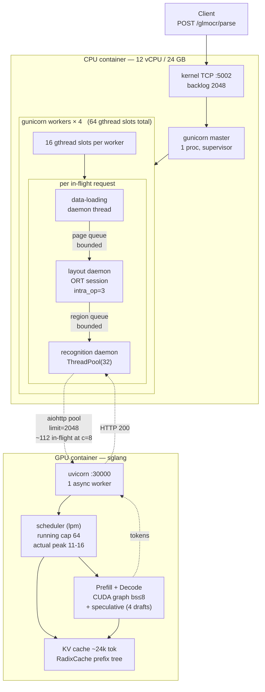
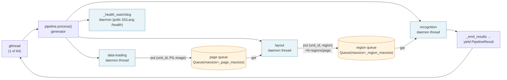
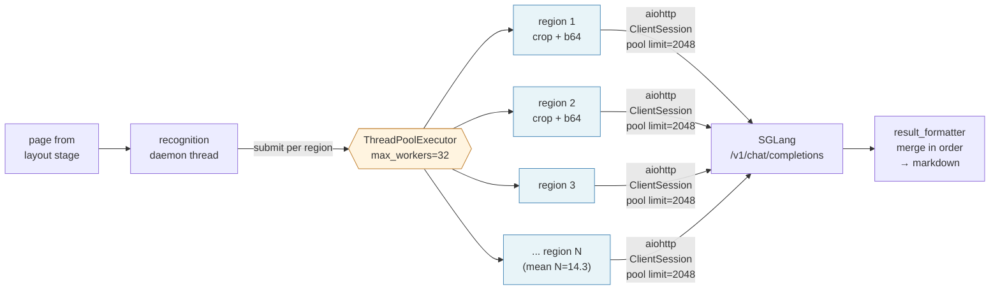
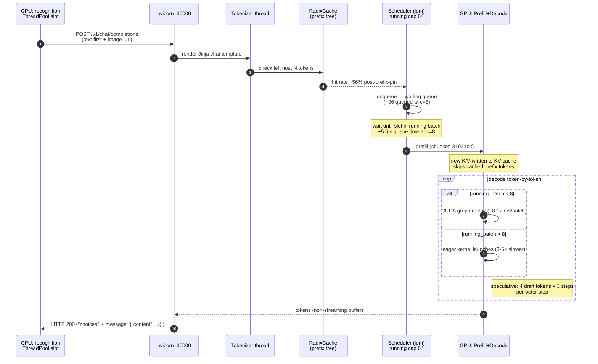
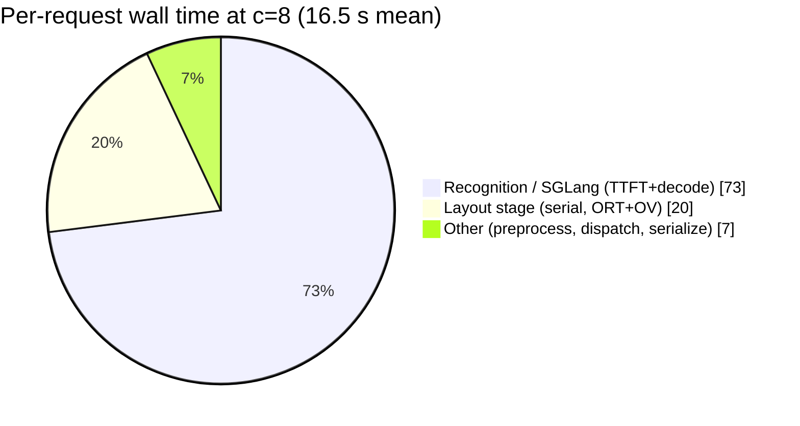
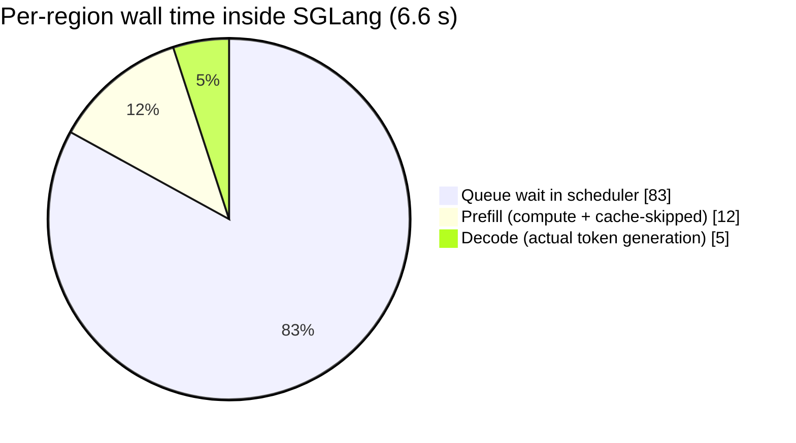
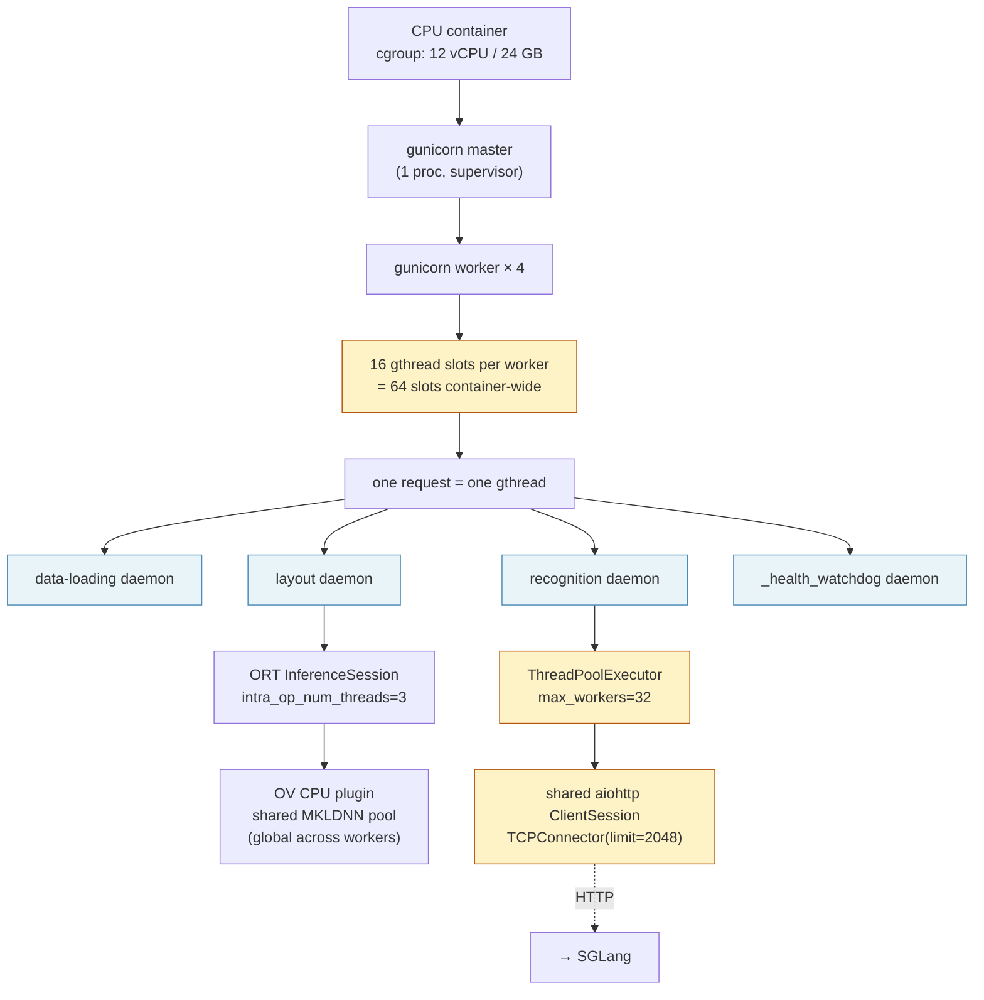
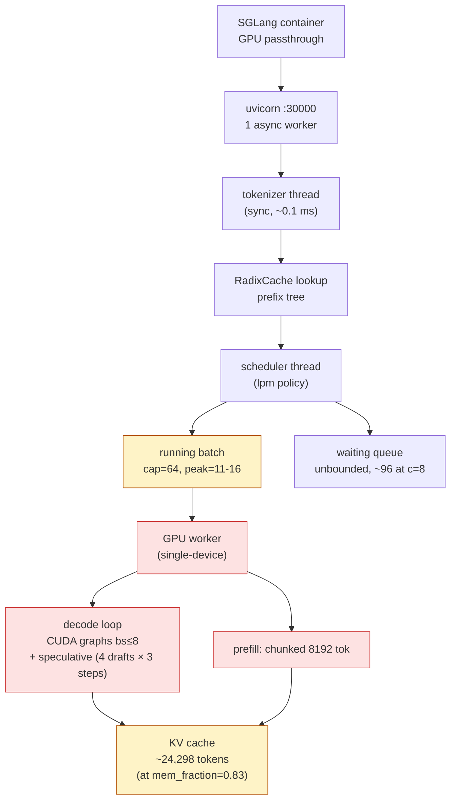
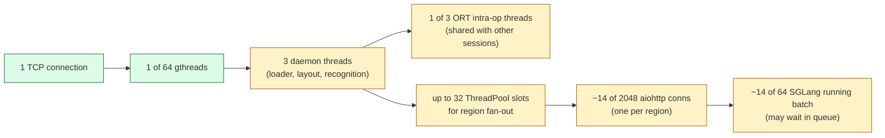
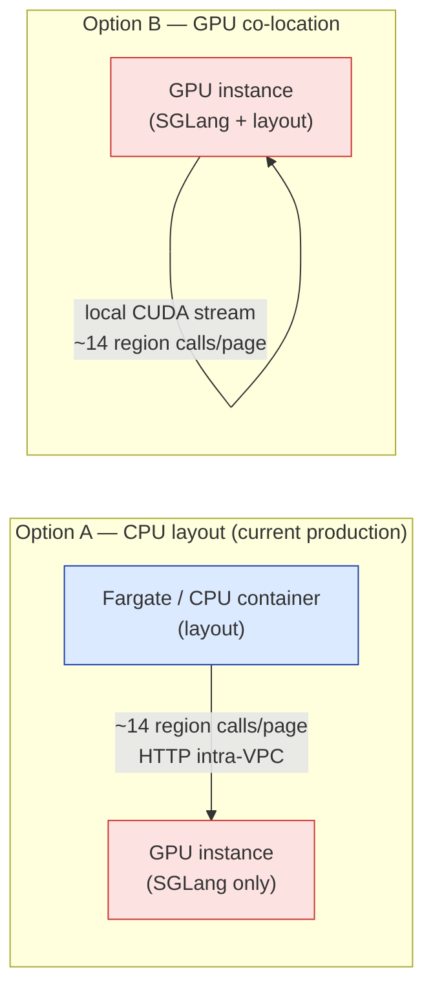

# GLM-OCR Architecture v2 — End-to-End Request Lifecycle

| | |
|---|---|
| **Status** | Published |
| **Version** | v2.0 |
| **Last updated** | 2026-04-25 |
| **Owner** | GLM-OCR platform team |
| **Predecessor** | `docs/ARCHITECTURE.md` (v1, file layout and deployment shape) |
| **Companion** | `docs/OPTIMIZATIONS.md` (rationale for each tuning knob) |

## TL;DR

This document traces a single `POST /glmocr/parse` request from the client's TCP socket through every thread, queue, and cache layer in the GLM-OCR stack, and back. It covers two containers: a CPU-bound Flask + gunicorn front end that runs document layout detection, and a GPU-bound SGLang server that performs per-region vision-language OCR.

Three takeaways drive every design choice in the system:

1. **The CPU container's hard concurrency ceiling is `CPU_WORKERS × CPU_THREADS = 64` simultaneous HTTP requests**, fanning out to up to `OCR_MAX_WORKERS = 32` per-region calls each. The aiohttp connection pool (2048) is sized to be exactly `64 × 32`, so no request ever waits for a connection.
2. **SGLang's running-batch cap (64) is the system's binding constraint**, not any CPU-side limit. At c=8 concurrent requests, ~112 region calls are in flight and ~96 of them are queued at any moment.
3. **Actual GPU compute accounts for ~5% of end-to-end wall time**; the remainder is queue wait, prefill, and CPU-side layout inference.

Section 0.1 below is a single-page slot-and-thread inventory that anyone debugging concurrency in this system should read first.

## Audience

Engineers familiar with Docker, Flask, and Python concurrency who need to understand what happens between `curl localhost:5002/glmocr/parse` and the JSON response.

## Table of contents

- [0. Top-down overview](#0-top-down-overview)
  - [0.1 Thread and slot inventory](#01-thread-and-slot-inventory)
  - [0.2 Master flowchart](#02-master-flowchart)
- [1. Network and TCP ingress](#1-network-and-tcp-ingress)
- [2. Request entry: Flask routing and handler](#2-request-entry-flask-routing-and-handler)
- [3. The three-worker pipeline](#3-the-three-worker-pipeline)
- [4. Data-loading worker (Stage 1)](#4-data-loading-worker-stage-1)
- [5. Layout worker (Stage 2)](#5-layout-worker-stage-2)
- [6. Recognition worker (Stage 3)](#6-recognition-worker-stage-3)
- [7. The SGLang GPU side](#7-the-sglang-gpu-side)
- [8. Response assembly back on the CPU container](#8-response-assembly-back-on-the-cpu-container)
- [9. Per-stage latency budget at c=8](#9-per-stage-latency-budget-at-c8)
- [10. Failure modes](#10-failure-modes)
- [11. Cross-reference map](#11-cross-reference-map)
- [12. Threading model — quick recap](#12-threading-model--quick-recap)
- [13. Appendix: Layout inference — CPU vs GPU placement](#13-appendix-layout-inference--cpu-vs-gpu-placement)

---

## 0. Top-down overview

The system is two containers connected over an HTTP loopback:

- **`glmocr-cpu`** — Flask + gunicorn front end. Resolves input URLs, runs CPU-side layout detection (Paddle2ONNX + ONNX Runtime + OpenVINO Execution Provider), and fans each detected region out to the GPU container as a separate VLM call.
- **`glmocr-sglang`** — SGLang server with GPU passthrough, exposing an OpenAI-compatible `POST /v1/chat/completions` endpoint that performs per-region OCR using the GLM-OCR vision-language model.

End-to-end wall time on the current configuration at c=8 concurrency is **~16.5 s per request** for a typical OmniDocBench page (mean 14.3 detected regions). Section 9 allocates that budget down to the millisecond.

### 0.1 Thread and slot inventory

Every concurrency parameter in one place. **Slots** is the hard cap each stage can hold; **at c=8** is the measured or computed utilization at the reference working load (8 concurrent client requests).

| Layer | Parameter | Source | Slots | At c=8 usage |
|---|---|---|---|---|
| Kernel | TCP listen backlog | gunicorn default | 2048 | <1% |
| CPU container | gunicorn workers | `CPU_WORKERS` | **4** procs | 4/4 resident |
| Per gunicorn worker | gthread request slots | `CPU_THREADS` | **16** per worker | ~2 busy per worker |
| Container total | max concurrent HTTP | = workers × gthreads | **64** gthreads | ~8 busy |
| Per in-flight request | pipeline daemon threads | `pipeline.py:140-172` | **3** (+1 watchdog) | always all 3 |
| Per request | page queue depth | `_page_maxsize` | 2×`CPU_WORKERS`·n_pages | usually 0 |
| Per request | region queue depth | `_region_maxsize` | 2×`CPU_WORKERS`·mean_regions | 0-14 typical |
| Per request | recognition fan-out | `OCR_MAX_WORKERS` | **32** thread pool | ~14 busy (14 regions/page) |
| Container | aiohttp connection pool | `OCR_CONN_POOL` | **2048** conns | ~112 in-flight |
| Per ORT session | intra-op kernel threads | `LAYOUT_ONNX_THREADS` | **3** | dynamic |
| Per ORT session | OpenMP threads | `OMP_NUM_THREADS` | **1** | bounded |
| Per ORT session | MKL BLAS threads | `MKL_NUM_THREADS` | **1** | bounded |
| Layout batcher | coalesce batch size | `LAYOUT_BATCH_MAX` | **8** pages | <batch typical |
| Layout batcher | coalesce wait window | `LAYOUT_BATCH_WINDOW_MS` | **20** ms | wall-time tax |
| OV EP | CPU plugin thread pool | OV default (shared) | global, ~N_cores | shared across workers |
| GPU container | uvicorn workers | SGLang default | 1 async | saturated by design |
| SGLang scheduler | running batch cap | `SGL_MAX_RUNNING_REQUESTS` | **64** | peaks 11-16 |
| SGLang scheduler | waiting queue | unbounded | ∞ | ~96-100 queued at c=8 |
| SGLang prefill | chunked prefill tokens | `SGL_CHUNKED_PREFILL_SIZE` | **8192** tok/chunk | typical prompt = 1 chunk |
| SGLang decode | CUDA graph batch cap | `SGL_CUDA_GRAPH_MAX_BS` | **8** | peak 11-16 overflows to eager |
| SGLang KV cache | total tokens | derived from `SGL_MEM_FRACTION_STATIC=0.83` | **~24,298** tokens | load-dependent |
| SGLang speculative | draft tokens / step | `SGL_SPEC_NUM_DRAFT_TOKENS` | **4** | sniped on mismatch |
| SGLang speculative | lookahead steps | `SGL_SPEC_NUM_STEPS` | **3** | content-dependent |

**Rule of thumb.** The inbound ceiling is `CPU_WORKERS × CPU_THREADS = 64` simultaneous requests. Each request fans out to `OCR_MAX_WORKERS = 32` region calls. A single container can therefore generate up to `64 × 32 = 2048` in-flight region requests — exactly the aiohttp pool size, by construction. This is the oversubscription ceiling; nothing in the stack can exceed it.

### 0.2 Master flowchart



---

## 1. Network and TCP ingress

### 1.1 Client → Docker published port

Container `glmocr-cpu` publishes 5002 via `docker-compose.yml: ports: ["5002:5002"]`. Docker Desktop's VPNKit (on Windows/macOS) or iptables DNAT rules (on Linux) forward `host:5002 → container:5002`. NAT overhead is ~0.1 ms per request on Linux and noticeably higher on Windows, which accounts for the gap between containerized and bare-metal benchmarks on Windows hosts.

### 1.2 gunicorn master socket

`docker/cpu/entrypoint.sh` launches:

```
exec gunicorn --worker-class gthread \
              --workers ${CPU_WORKERS:-4} --threads ${CPU_THREADS:-16} \
              --timeout ${GUNICORN_TIMEOUT:-480} \
              --bind 0.0.0.0:5002 wsgi:app
```

Gunicorn master (pid 1) calls `socket(), bind(), listen()` on 0.0.0.0:5002 and then forks `CPU_WORKERS=4` workers. Each worker inherits the listening socket. When a client connects, the kernel wakes exactly one worker (thundering-herd avoidance via `SO_REUSEPORT` is NOT used by default; gunicorn uses its own round-robin). The master itself never touches application traffic — it exists to supervise workers (respawn on crash, graceful restart on `SIGHUP`, rotate max-requests).

### 1.3 gthread worker acceptance

Worker class `gthread` is required (see `OPTIMIZATIONS.md` supporting-knob Section 5). The alternatives all fail in this stack:

- `sync` would dedicate one entire worker to one request at a time. With 4 workers, max in-flight is 4, so at c=8 half of all requests would block on `accept()`.
- `gevent` and `eventlet` monkey-patch stdlib threading, which breaks PyTorch and ONNX Runtime's C-level thread pools. Their TBB/OpenMP kernels assume OS threads, not greenlets, and silently misbehave under monkey-patching.
- `gthread` uses a pool of `--threads 16` OS threads per worker. `accept()` returns in a thread, the thread runs the WSGI app synchronously for that request, then returns to the pool. Max in-flight per worker is 16; across the container, **64 concurrent requests**.

At c=8, each of 4 workers handles ~2 concurrent requests on average, well under the 16-thread cap.

### 1.4 WSGI adapter

`wsgi.py` is a one-liner:

```python
from glmocr.server import create_app
from glmocr.config import load_config
app = create_app(load_config("/app/config.yaml"))
```

This runs **once per worker at import time**, well before the first request arrives. All pipeline state — daemon threads, ORT sessions, aiohttp pools, model weights — is initialized here, before the worker is added to the gunicorn accept pool.

---

## 2. Request entry: Flask routing and handler

### 2.1 Route dispatch

Flask's Werkzeug routing maps `POST /glmocr/parse` to `glmocr/server.py:75 @app.route("/glmocr/parse", methods=["POST"])`. The `prometheus-flask-exporter` middleware wraps the handler to record `flask_http_request_duration_seconds` histogram buckets keyed by `url_rule + method + status` (see OPTIMIZATIONS.md Section 5 for why the shared-tmpfs multiproc dir matters across workers).

### 2.2 `def parse()` — body validation

```python
# glmocr/server.py:92-117 (paraphrased)
if request.headers.get("Content-Type") != "application/json":
    return jsonify(error=...), 400
data = request.json                        # werkzeug lazy-parses
images = data.get("images", [])
if isinstance(images, str): images = [images]
if not images and "file" in data:          # MaaS-client back-compat
    images = [data["file"]]
```

A few μs total; synchronous; runs in the gthread that caught the accept.

### 2.3 Building the pipeline request

```python
# server.py:124-131 — the handler packs every input URL as an image content item:
messages = [{"role": "user", "content": []}]
for image_url in images:
    messages[0]["content"].append({
        "type": "image_url",
        "image_url": {"url": image_url}
    })
request_data = {"messages": messages}
```

Note the handler receives image **URLs**, not base64 blobs. A URL can be `file:///app/...` (bind-mounted dataset), `http://...`, `https://...`, or `data:image/png;base64,...`. The loader worker downstream will resolve whatever form the URL takes.

### 2.4 `pipeline.process(request_data)` — generator call

`pipeline.process` is a **generator** defined at `glmocr/pipeline/pipeline.py:108`. Calling it returns an iterator without running any work; execution is forced by the handler via `list(pipeline.process(...))`. Each yielded value is one `PipelineResult`, corresponding to one input page's OCR output.

---

## 3. The three-worker pipeline

**Slots at this phase:** 3 daemon threads per request + 1 health watchdog. Two bounded queues between them. No locks beyond Python's `queue.Queue` internals.

`pipeline.process()` is the orchestration core. It launches three daemon threads per request and emits results via the generator protocol.



Bounded queues provide back-pressure: when the layout stage is slow, the data-loading thread's `put()` blocks, preventing memory from ballooning with pending work. The only effectively unbounded resource downstream is the aiohttp connection pool (2048 connections), sized to exceed the worst-case product `CPU_THREADS × OCR_MAX_WORKERS = 512` with a 4× safety margin.

```python
# pipeline.py:140-172 (paraphrased)
state = PipelineState(page_maxsize=_page_maxsize, region_maxsize=_region_maxsize)
tracker = UnitTracker(num_units)
state.set_tracker(tracker)

t1 = Thread(target=data_loading_worker, args=(state, page_loader, image_sources), daemon=True)
t2 = Thread(target=layout_worker,       args=(state, layout_detector, ...),       daemon=True)
t3 = Thread(target=recognition_worker,  args=(state, page_loader, ocr_client, self.max_workers), daemon=True)
# + _health_watchdog thread
t1.start(); t2.start(); t3.start(); t_watchdog.start()

try:
    yield from self._emit_results(state, tracker, ...)
finally:
    state.request_shutdown()
    t1.join(timeout=10); t2.join(timeout=10); t3.join(timeout=10)
```

**Why three threads instead of inline synchronous code?** Each stage has a different CPU/IO shape:

| Stage | Bottleneck | Contention |
|---|---|---|
| data-loading | IO (URL fetch or PDF rasterize) | GIL-light |
| layout | CPU (ORT + OV kernels, releases GIL during C calls) | burstier |
| recognition | IO (HTTP to SGLang) | many parallel aiohttp |

Running them as a pipeline lets the stages overlap: while layout runs on page N, the loader has already fetched page N+1, and recognition is already OCR-ing page N-1's regions. Bounded queues (`page_maxsize`, `region_maxsize`) prevent a slow stage from accumulating unbounded work behind it.

All three threads run **inside the same gthread** that accepted the request and share memory. On a single-image `/glmocr/parse` call the data-loading work is trivial, so mainly the layout and recognition stages serialize per page. Across concurrent requests, multiple pipelines run simultaneously, and the layout stage of request A can overlap with the recognition stage of request B.

---

## 4. Data-loading worker (Stage 1)

### 4.1 URL → bytes

`data_loading_worker` (in `glmocr/pipeline/data_loading.py`, wrapped as a method on `PageLoader`) resolves each URL:

- **file://** — direct open
- **http/https** — `requests.get` with a timeout (inherited from `page_loader` config)
- **data:** — base64 decode in-memory
- **PDF byte sniff** — if first bytes are `%PDF-`, invoke `pdfium2` to rasterize pages

### 4.2 PDF rasterization

PDF pages are rasterized to PIL images at a configurable DPI (default 200). `pdfium2` is a C library with Python bindings; it releases the GIL during rendering, so concurrent data-loading workers across requests benefit from multi-core scaling. For the OmniDocBench reference workload, all inputs are pre-rasterized `.png` / `.jpg` and this path is dormant.

### 4.3 PIL open and enqueue

For images: `PIL.Image.open(bytes)` creates a lazy handle (no pixel decode yet). The worker pushes `(unit_id, page_index, PIL.Image)` onto the page queue and proceeds.

### 4.4 Page queue

A `queue.Queue(maxsize=page_maxsize)`. When the downstream layout worker is slow, `put()` blocks and the loader thread idles. Default `_page_maxsize` is typically `2 × workers × n_pages_per_pdf`; on the single-image reference workload this queue never backs up.

---

## 5. Layout worker (Stage 2)

The layout worker pulls a `(unit_id, page)` tuple from the page queue, runs the detector, and pushes one or more `(unit_id, region)` tuples onto the region queue. This stage hosts most of the v2 optimization work (Paddle2ONNX backend, OpenVINO Execution Provider, prefix-pin patches).

Runtime dispatch is built at gunicorn worker startup via `install_pipeline_gauges(app)` in `docker/cpu/runtime_app.py:540-750`. At import time, `runtime_app.py` examines the `LAYOUT_VARIANT` and `LAYOUT_BACKEND` environment variables and **monkey-patches** `ld.process` (where `ld = pipeline.layout_detector`) to replace glmocr's default torch-eager path with one of three implementations:

1. `LAYOUT_VARIANT=paddle2onnx` → Paddle2ONNX + ORT + (optionally) OpenVINO Execution Provider. This is the production path.
2. `LAYOUT_BACKEND=onnx + LAYOUT_POSTPROC=numpy` → torch-exported ONNX with numpy post-processing (legacy path, retained as fallback).
3. Default → upstream torch eager (slowest; used only if the above two fail to initialize).

In the production configuration, all four gunicorn workers take path (1). The remainder of this section traces that path step by step.

### 5.1 PIL → pixel tensor (`layout_paddle2onnx.py:_preprocess_batch`)

```python
# For each PIL image in the batch:
resized = im.resize((800, 800), Image.BILINEAR)      # shrink to model input size
arr = np.asarray(resized, dtype=np.float32) / 255.0  # RGB / 255 — see Section 6 gotcha
arr = arr.transpose(2, 0, 1)                         # HWC → CHW
return np.stack(batch, axis=0)                       # (B, 3, 800, 800)
```

The `/255` step is essential. `config.json` declares `norm_type=none`, but Paddle's C++ loader applies `/255` before `NormalizeImage` ever sees the tensor. Without this, the maximum detection score is 0.014 — below threshold, so no regions are emitted. This produces a silent-empty-output failure that is indistinguishable at the HTTP layer from a successful response on a blank page.

### 5.2 3-input feed construction (`_build_session_inputs`)

Paddle2ONNX expects three inputs:

| input | shape | semantics |
|---|---|---|
| `image` | `(B, 3, 800, 800)` float32 | the preprocessed pixel tensor |
| `im_shape` | `(B, 2)` float32 | original `[H, W]` per image |
| `scale_factor` | `(B, 2)` float32 | nominally `(H_orig/800, W_orig/800)` |

The `scale_factor` input is effectively a no-op in this export; the graph ignores it. The adapter passes semantically correct values anyway, but output boxes come back in **800² coordinate space** and are manually rescaled to original image space downstream (see Section 5.5).

### 5.3 ORT session invocation

`sess.run(None, feed)` is a single C-level call into ONNX Runtime. Python's GIL is **released** for the duration, which is what allows multiple concurrent requests to run layout in parallel across worker gthreads.

Inside the call:

```
┌─ onnxruntime.InferenceSession.run() ─────────────────────────────────────┐
│                                                                          │
│  1. OrtApi::Run dispatches to the InferenceSession C++                   │
│  2. Session checks providers in order: [OpenVINOExecutionProvider]       │
│  3. OV EP's CompiledModel takes ownership of the graph (partial or full) │
│  4. OV's CPU plugin runs the compiled IR:                                │
│     - MKLDNN kernels for Conv, MatMul, BatchNorm                         │
│     - Optimized attention fusion for the DETR decoder heads              │
│     - The 24 graph passes OV captured at session init fire here          │
│  5. Output tensors flow back up the stack as numpy arrays                │
│                                                                          │
└──────────────────────────────────────────────────────────────────────────┘
```

At c=8 with 4 workers × 3 intra-op threads (via `LAYOUT_ONNX_THREADS=3`), this call takes 0.8–1.2 s per single-image forward pass (measured by `scripts/bench_paddle_ep.py`). The **unpinned OV default** uses a shared global thread pool across sessions, which empirically scales better than a fixed per-session pool under the production worker count.

Output is a tuple of three numpy arrays:

| Output | Shape | Meaning |
|---|---|---|
| `fetch_name_0` | `(N_det, 7)` float32 | Detection table: `[class_id, score, x1, y1, x2, y2, extra]`, ragged across batch. |
| `fetch_name_1` | `(B,)` int32 | Per-image detection counts; used to un-ragged `fetch_name_0`. |
| `fetch_name_2` | `(N_det, 200, 200)` int32 | Mask tensors. Unused by the current adapter, which builds rectangular polygons directly from boxes. |

### 5.4 Ragged → per-image regrouping

`_ungroup_detections` reads `fetch_name_1` as per-image counts, slices `fetch_name_0` into per-image arrays, and applies the pre-NMS score threshold (from `ld.threshold`, typically 0.5).

### 5.5 800² → original image coord rescale

Because the `scale_factor` input is a no-op, boxes come back in 800² space. `_rescale_and_build_raw` does the manual rescale:

```python
sx = w_orig / 800.0
sy = h_orig / 800.0
x1, y1, x2, y2 = dets[:,2]*sx, dets[:,3]*sy, dets[:,4]*sx, dets[:,5]*sy
```

It also builds a rectangular `polygon_points` per detection (the box corners) and synthesizes `order_seq` as `arange(N)`. The Paddle2ONNX export does not include glmocr's DETR reading-order head, so downstream reading order is the model's natural output order — stable, but not semantically optimized for multi-column layouts.

### 5.6 NMS and label routing

Control passes to the shared `np_apply_layout_postprocess` function in `layout_postprocess.py` (reused from the torch path). It performs:

- **NMS** with `iou_same=0.6, iou_diff=0.98` — aggressive within a class, permissive between classes.
- **Oversized-image filter** — detections labeled `image` occupying more than 82–93 % of page area (orientation-dependent) are dropped, as a heuristic against spurious whole-page detections.
- **Unclip** — optional, off by default.
- **Merge_bboxes_mode** — off by default.

`paddle_to_all_results` then maps class IDs through glmocr's native `id2label`, captured at startup — **not** through Paddle's `config.json` mapping, which uses more granular names that would miss glmocr's routing table. The output is JSON blocks with `bbox_2d` normalized to 0–1000 per-image coordinates rather than original pixel coordinates; downstream consumers must rescale accordingly.

### 5.7 Region emission

For each detection that survives post-processing, the layout worker pushes a region tuple onto the region queue. A typical OmniDocBench page yields **12–20 regions**, mostly `text`, with occasional `table`, `formula`, and `footer`. The measured mean is **14.3 regions per page at c=8**.

---

## 6. Recognition worker (Stage 3)

**Slots at this phase:** 1 orchestrator thread, `OCR_MAX_WORKERS=32` ThreadPool slots, and up to 2048 aiohttp connections from the shared pool. Per page, ~14 regions fire concurrently.

`recognition_worker` pulls `(unit_id, region, task_type)` tuples from the region queue. For each region:

1. Crop the region out of the original PIL image using the box coords.
2. Call `page_loader.build_request_from_image(crop, task_type)` to build an OpenAI-compatible request.
3. Submit the request to `ocr_client.process()` via a ThreadPoolExecutor of size `max_workers=OCR_MAX_WORKERS=32`.

The ThreadPoolExecutor is the **intra-request** fan-out — all 14 regions of a single page fire concurrently to SGLang.



At **c=8 concurrent requests × 14 regions = 112 in-flight SGLang calls**. The aiohttp pool at 2048 has ~18× headroom; the binding bottleneck is SGLang's 64-slot running batch downstream, not this fan-out.

### 6.1 Request construction with prefix-pin

`runtime_app.py:549-597` replaces `PageLoader.build_request_from_image` at worker startup with:

```python
content = [
    {"type": "text", "text": "Transcribe the text in the image."},  # stable per task
    {"type": "image_url", "image_url": {"url": "data:image/jpeg;base64,..."}},
]
```

**Text first, image second** — the inverse of upstream glmocr's order. This matters because SGLang's RadixCache deduplicates only on **leftmost common tokens**:

- With image-first ordering, every region's prefix consists of unique image tokens, yielding a 0% cache hit rate.
- With text-first ordering, the prompt tokens (`"Transcribe the text..."` plus the chat-template wrapper) are identical across all regions, enabling cache hits.

Measured impact: **12% → 56% prefix-cache hit rate**, with TTFT cut roughly in half at c=8. See `OPTIMIZATIONS.md` Section 8 for the full rollout history.

### 6.2 Base64 encoding

`load_image_to_base64` (also in `page_loader.py`) JPEG-encodes the PIL crop at quality 85 (configurable), base64-encodes, builds the `data:image/jpeg;base64,...` URL. Typical crop is 10-30 KB of base64. This runs on the worker thread and does NOT release the GIL (pure Python path).

### 6.3 aiohttp request

`OCRClient.process()` uses a shared `aiohttp.ClientSession` with `connector=TCPConnector(limit=OCR_CONN_POOL=2048)`. The pool is dimensioned to `CPU_THREADS × OCR_MAX_WORKERS × safety = 2048` so no request ever waits for a connection slot.

The actual HTTP payload is OpenAI-compatible:

```json
POST http://sglang:30000/v1/chat/completions
{
  "model": "glm-ocr",
  "messages": [{"role": "user", "content": [{"type": "text", ...}, {"type": "image_url", ...}]}],
  "max_tokens": 2048,
  "temperature": 0.0,
  ...
}
```

### 6.4 Retry logic

`OCRClient` has a built-in retry loop. Configuration: `retry_max_attempts: 2`, exponential backoff 0.5–8 s, retries on HTTP 429 / 500 / 502 / 503 / 504. Under SGLang overload this fires; if SGLang is still unhealthy on the third attempt, the request returns empty content. This is one of the silent-empty failure paths described in Section 10.1: the HTTP envelope is 200 OK, but `markdown_result=""`. Load drivers must therefore assert on response body content, not just HTTP status. See `OPTIMIZATIONS.md` "Driver body-content assertion" for the mitigation plan.

---

## 7. The SGLang GPU side

**Slots at this phase:** 1 uvicorn async worker, 1 scheduler thread, running-batch cap 64 (actual peak 11–16), KV cache ~24,298 tokens, CUDA graphs pre-captured for batch sizes 1–8. This is where every CPU-side thread in the stack eventually converges.

Past this point the request leaves `glmocr-cpu` and enters `glmocr-sglang`, which has GPU passthrough configured via `deploy.resources.reservations.devices` with `capabilities: [gpu]` in `docker-compose.yml`.



### 7.1 uvicorn → OpenAI-compatible handler

SGLang serves a FastAPI app via uvicorn on :30000. `POST /v1/chat/completions` hits SGLang's request dispatcher. The request gets an ID, queued into SGLang's tokenizer thread.

### 7.2 Tokenization + chat template

The tokenizer (shipped with `zai-org/GLM-OCR`) renders the message list via its Jinja chat template. For the prefix-pin request shape, the rendered token stream begins:

```
<|begin_of_sentence|><|start_of_role|>user<|end_of_role|>Transcribe the text in the image.<image><|end_of_role|>...
```

The `<image>` token is a placeholder; the vision-language model's vision encoder substitutes the actual image token embeddings at prefill time. Tokenization is fast (~0.1 ms), CPU-side, and produces a **deterministic token sequence for the prompt prefix** — the property that makes prefix caching effective.

### 7.3 RadixCache lookup

Before scheduling, SGLang's `TokenToKVPoolAllocator` checks whether the leftmost N tokens of this sequence already have K/V computed and resident in the KV cache. The cache is a **radix tree** keyed on token sequences, so if the prompt prefix has been seen before, the first ~20–30 tokens of prefill are skipped: the `prefill_cache` counter increments, while `prefill_compute` stays flat.

Measured cache-hit rates at c=8:

- Post-prefix-pin (Section 6.1): **56.5%** of prefill tokens.
- Post-0.83 mem-fraction reduction (Section 9): **12.3%** — a smaller KV cache thrashes harder under concurrent regional fan-out.

### 7.4 Scheduler

`SGL_SCHEDULE_POLICY=lpm` (Longest-Prefix-Match) is preferred over `fcfs` because, on this workload, it clusters requests with the same prompt prefix and increases cache reuse. Benchmarks have shown `fcfs` regresses RPS by 16–28% at c=12/24 on the production stack. The scheduler maintains:

- **Running batch** — requests currently being decoded, capped by `SGL_MAX_RUNNING_REQUESTS=64`.
- **Waiting queue** — requests that have arrived but not yet been admitted to the running batch.

At c=8 with 112 regions in flight competing for the 64-slot running batch, most regions spend 10+ seconds in the waiting queue before being scheduled. This wait time dominates the **TTFT** (time-to-first-token) component of per-region metrics.

KV cache sizing tradeoff:

- `SGL_MEM_FRACTION_STATIC=0.83` — KV cache holds 24,298 tokens total. At c=8 with ~300 concurrent tokens per region across 16+ concurrent regions, this is tight but stable.
- `SGL_MEM_FRACTION_STATIC=0.95` — KV cache holds 37,710 tokens (larger cache, higher hit rate), but leaves insufficient dynamic memory for activations and OOMs at c ≥ 24.

### 7.5 Prefill

New token K/V (those not found in RadixCache) go through **chunked prefill** — `SGL_CHUNKED_PREFILL_SIZE=8192` tokens per forward pass. For a typical ~600-token prompt this is one chunk; larger documents may span multiple. Each chunk is a forward pass through the model on the GPU:

- Image embeddings come from the VLM's vision encoder (a small CNN+projector).
- Text tokens get their usual embedding lookup.
- Combined sequence runs through the transformer stack (attention + MLP × N layers).
- K/V for all positions is written to the KV cache.

Prefill is attention-heavy compute. A 600-token fresh prefill takes ~1–2 s on the development-grade GPU (NVIDIA RTX 3060 Ti, 8 GB) when the GPU is not queue-bound. Production hardware will scale this proportionally.

### 7.6 Decode loop

Once prefill is complete, SGLang enters the decode loop. Each step generates one token per request in the running batch. There are two execution paths:

- **Fast path — CUDA graphs.** With `SGL_CUDA_GRAPH_MAX_BS=8` (the default), pre-captured CUDA graphs for batch sizes 1–8 replay in ~8–12 ms per batch. This is the typical case at c ≤ 8.
- **Slow path — eager execution.** When the running batch exceeds 8, graph replay misses and execution falls back to per-op `torch.cuda` kernel launches — roughly 3–5× slower. The running batch on this workload peaks at 11–16, so some decode steps land on the slow path.

Raising `SGL_CUDA_GRAPH_MAX_BS=16` would cover the observed peak but adds ~200–400 MB of graph memory. On the 8 GB development card at `mem_fraction=0.83` this fit is too tight; the optimization is documented but not currently shipped.

**Speculative decoding** is enabled via `SGL_SPECULATIVE=true` and `SGL_SPEC_ALGORITHM=NEXTN`. An EAGLE-style draft model predicts `SGL_SPEC_NUM_STEPS=3` tokens ahead; the target model verifies all three in a single forward pass. Effectiveness varies with content predictability — repetitive text yields a 2–2.5× speedup, while dense formula content can actually regress. On GLM-OCR document text the net effect is positive. The `SGL_SPEC_EAGLE_TOPK=1` and `SGL_SPEC_NUM_DRAFT_TOKENS=4` knobs tune the branching factor.

Measured decode throughput on the development hardware: **~0.5 s per region** (computed as `sglang:e2e_request_latency_seconds_sum − sglang:time_to_first_token_seconds_sum`). This represents actual GPU work; any per-region wall time beyond ~0.5 s is queue wait, per the budget in Section 9.

### 7.7 Token streaming out

Tokens flow through SGLang's output processor: detokenization, stop-string handling, then buffering into the response. The OpenAI-compatible endpoint can stream via SSE, but the CPU client uses non-streaming mode — SGLang buffers the full response and returns `{"choices":[{"message":{"content":"..."}}]}`.

---

## 8. Response assembly back on the CPU container

### 8.1 OCRClient receives per-region text

`OCRClient.process()` parses the OpenAI response, extracts `choices[0].message.content`, returns it as the region's text.

### 8.2 Result formatter

As each region completes, `result_formatter.py` threads it back into the page's result:

- `text` regions → markdown as-is.
- `formula` regions → wrapped in `$$...$$`.
- `table` regions → emitted as HTML `<table>` (GLM-OCR is trained to produce this format directly).
- Headers → `## ...`.
- Footers and page-numbers → appended at the end.

The final markdown is concatenated in reading order. Because the Paddle2ONNX adapter synthesizes `order_seq` as the model's natural output order rather than running glmocr's DETR reading-order head, multi-column layouts may produce subtly suboptimal ordering. This is an accepted tradeoff in exchange for the batching correctness gained from the Paddle2ONNX export.

### 8.3 PipelineResult yield

The recognition worker writes the finished page into the state's output slot. `_emit_results` in `pipeline.py` reads from the output side in order (if `preserve_order=True`) and yields one `PipelineResult` per input unit back to the handler.

### 8.4 Flask `jsonify` + gunicorn send

Back in `server.py:_build_response` → `jsonify()` → WSGI app returns. Gunicorn's gthread sends the response bytes. Connection closes (HTTP/1.1 `Connection: close` by default).

---

## 9. Per-stage latency budget at c=8

**Measured on the production stack.** This section attributes every millisecond of wall time to a specific slot from Section 0.1 or queue from Section 3.





Detailed breakdown for one 20-page burst at c=8 (n=20, seed=42):

```
16.5 s  per request (client-measured mean)
├── 3.3 s   layout stage (serial)                      ~20 %
│     ├── 0.05 s  PIL preprocess + build ORT feed
│     ├── ~0.8 s  ORT + OV EP forward (amortized if batched)
│     ├── ~0.05 s numpy NMS + postproc
│     └── ~2.4 s  waiting for prior layout call to return (batch window)
│
├── 12.0 s  recognition stage wall (parallel 14 regions @ OCR_MAX_WORKERS=32)   ~73 %
│     Per-region (mean over 14 × 8 concurrent = 112 in-flight regions):
│     ├── ~6.3 s  TTFT (queue wait + prefill on SGLang)     ~90 % of region time
│     │         Decomposes further into:
│     │         - queue wait: ~5.5 s  (the binding factor)
│     │         - prefill:    ~0.8 s  (varies with cache-hit %)
│     └── ~0.3 s  decode (actual GPU token generation)      ~5 %
│
└── ~1.2 s  other (preprocess, dispatch, serialization)                       ~7 %
```

Three load-bearing invariants:

1. **Layout is the CPU bottleneck**, but at ~20% of wall time it is not the binding system-wide bottleneck — SGLang queue wait is.
2. **Actual GPU compute accounts for ~5%** of wall time. The GPU is idle or queue-blocked for the remainder.
3. **Prefix caching is the largest latency lever.** Every percentage point of cache hit translates directly to less prefill compute. The current 12–56% hit rate (load-dependent) has significant headroom.

At c=16, queue depth roughly doubles and TTFT climbs to ~13 s, while decode remains at ~0.5 s. See `OPTIMIZATIONS.md` Section 8 for the measurement methodology.

---

## 10. Failure modes

### 10.1 Silent empty-markdown

The most dangerous failure class: HTTP 200 with `markdown_result=""`. Three known root causes:

- **Layout ONNX crashes mid-batch.** The `node_view_320` Reshape bug on the torch-exported graph; resolved by the Paddle2ONNX migration described in Section 5.
- **SGLang unavailable or refusing connections.** The internal `OCRClient` retry loop exhausts and returns empty content rather than propagating an error.
- **Layout detects zero regions.** A legitimate edge case for near-blank pages.

All three are indistinguishable to a load driver that only checks HTTP status. Drivers must assert on response body content (`len(markdown_result) > 0`) as a non-negotiable invariant. See `OPTIMIZATIONS.md` "Driver body-content assertion" for the rollout plan.

### 10.2 Timeouts

| Knob | Bound |
|---|---|
| `OCR_REQUEST_TIMEOUT=60` | Each CPU → SGLang HTTP call. |
| `OCR_RETRY_MAX=2` | Up to 3 total attempts per region. |
| `GUNICORN_TIMEOUT=480` | The entire `/glmocr/parse` call end-to-end. |

If SGLang is fully unavailable, each region can spend up to `3 × 60 = 180 s` waiting before the handler gives up. Combined with the 20 ms layout batch window, this can cascade into many pages' worth of regions timing out together. The `_health_watchdog` thread mitigates this by polling SGLang's `/health` endpoint and proactively aborting in-flight work if health checks fail for more than N seconds.

### 10.3 SGLang crashes and OOMs

On the 8 GB development card at `SGL_MEM_FRACTION_STATIC=0.95`, SGLang previously crashed mid-run at c ≥ 24 (OOM on the dynamic pool). Resolved by dropping to `0.83` (Section 9). The CPU-side `_health_watchdog` detects this within 5–10 s and surfaces the event in logs. SGLang auto-restarts via Docker's `restart: unless-stopped` policy, re-captures CUDA graphs (~10 s), rebuilds the KV cache, and resumes serving — but all in-flight requests at the time of the crash are lost.

### 10.4 gunicorn worker hangs

If a worker hits a deadlock inside PIL or numpy (a historical bug in some versions), `gunicorn --max-requests N` recycles the worker after N requests regardless. `GUNICORN_TIMEOUT` provides a separate per-request deadlock bound. `faulthandler` is registered on `SIGTERM` and `SIGUSR1`, so a stuck worker can be introspected with `kill -SIGUSR1 <pid>` for a Python-level stack dump.

### 10.5 KV cache thrash

A performance pathology rather than a hard failure. When concurrent requests evict each other's prefix K/V entries, the prefix-cache hit rate collapses (observed: 56% → 12% when moving from `mem_fraction=0.95` to `0.83`). This does not surface as an error; it manifests as climbing TTFT. The canonical signal is the `sglang:realtime_tokens_total{mode="prefill_cache"}` counter relative to `mode="prefill_compute"`.

---

## 11. Cross-reference map

| Topic | Primary reference |
|---|---|
| Paddle2ONNX adapter | `docker/cpu/layout_paddle2onnx.py` + `OPTIMIZATIONS.md` Section 6 |
| OpenVINO Execution Provider wiring | `docker/cpu/runtime_app.py:595-635` + `OPTIMIZATIONS.md` Section 7 |
| Prefix-pin monkey-patch | `docker/cpu/runtime_app.py:549-597` + `OPTIMIZATIONS.md` Section 8 |
| Memory-fraction tradeoff | `.env:SGL_MEM_FRACTION_STATIC` + `OPTIMIZATIONS.md` Section 9 |
| Rejected optimization paths | `OPTIMIZATIONS.md` "Rejected" section + `docs/omnidoc-2026-04-24-paddle-ov-shipment.md` |
| Experiment log | `docs/omnidoc-2026-04-24-paddle-ov-shipment.md` |
| File-by-file walkthrough | `docs/ARCHITECTURE.md` (v1) |
| Matrix-noise calibration methodology | Internal load-test playbook |

---

## 12. Threading model — quick recap

**CPU container at c=8:**

```
4 gunicorn workers × 16 gthreads = 64 max concurrent request-handling threads
  → each concurrent /glmocr/parse call uses ONE gthread
  → that gthread spawns 3 daemon threads (loader, layout, recognition)
  → the recognition thread uses a ThreadPoolExecutor(OCR_MAX_WORKERS=32)
  → each of those 32 pool threads holds an aiohttp Session connection (from pool of 2048)

At c=8: ~8 gthreads busy, ~24 daemon threads per pipeline active,
        ~112 aiohttp requests in-flight to SGLang, ~300 Python threads total.

Inside each layout call: the OV CPU plugin spawns its own MKLDNN thread pool,
effectively shared across concurrent sessions (the unpinned default).
```



**SGLang container:**

```
1 uvicorn worker (async) handles all HTTP requests
  → tokenizer thread (sync, fast)
  → scheduler thread runs the running-batch loop
  → GPU compute is single-process, single-device

Running batch cap 64, actual peak 11-16 (CPU-layout-limited arrival rate).
KV cache ~24,298 tokens total at SGL_MEM_FRACTION_STATIC=0.83.
```



The system is **stateful per worker** (aiohttp pools, ORT sessions, `ld.process` monkey-patches) and **stateless across workers** (no shared memory between gunicorn workers beyond the Prometheus multiproc directory). A gunicorn worker restart loses its local state, but not request history (which is held in Prometheus).

### 12.1 How a slot count propagates through the stack

A single `/glmocr/parse` request at c=8 occupies concurrency as follows:



At c=8 the CPU container is nowhere near its hard caps (8/64 gthreads, 112/2048 aiohttp connections). The downstream SGLang running-batch cap of 64 is hit at c ≈ 5 pages-in-flight, since each page fans out to ~14 regions. **SGLang's scheduler is the binding constraint, not any CPU-side slot count.** Every optimization in `OPTIMIZATIONS.md` Sections 6–9 either reduces SGLang queue depth (prefix-pin, memory-fraction) or makes layout faster so that regions arrive at SGLang in smaller bursts, allowing the queue more time to drain between bursts.

---

## 13. Appendix: Layout inference — CPU vs GPU placement

This appendix compares the current production placement (PP-DocLayoutV3 on a dedicated CPU tier) against co-locating layout inference on the same NVIDIA GPU that hosts SGLang. The choice materially shapes deployment topology, capacity, and cost.

### 13.1 The decision in one paragraph

PP-DocLayoutV3 is a Conv-dominated DETR-family detector (~76% of forward-pass wall time is convolutional kernels). It is therefore a natural candidate for GPU acceleration — a T4-class GPU runs the same forward pass 5–10× faster than a modern CPU. The catch is that the GPU in the GLM-OCR deployment is already hosting SGLang at high VRAM and SM utilization, so co-locating layout taxes the resource that the deployment exists to maximize. The right answer depends on a single workload property: **the average number of regions detected per page** (fan-out factor).

### 13.2 Side-by-side comparison

| Dimension | CPU tier (current production) | GPU co-location |
|---|---|---|
| Per-call forward time | 200–400 ms (Fargate AVX-512 + VNNI, ORT + OpenVINO EP), 800–1,200 ms on dev-grade Ryzen | 20–40 ms on T4 (FP16, ORT CUDA EP) |
| Speedup vs current | baseline | 5–10× per call |
| Host hardware | dedicated CPU container (Fargate or similar) | shared with SGLang on the same GPU instance |
| VRAM cost | 0 | ~600–900 MB (model + activations at batch 1–4); requires `SGL_MEM_FRACTION_STATIC` reduction from 0.83 to ~0.78 |
| KV cache impact | none | ~12–15% smaller (translates to ~3,000 fewer tokens at the production setting) |
| SM contention with SGLang | none | yes; layout's Conv stage is SM-heavy and bursty arrivals cause SGLang p99 spikes |
| Scaling axis | horizontal (more Fargate tasks) | vertical (bigger / additional GPU instances) |
| Per-region fan-out at peak | unaffected | reduces SGLang running-batch cap proportionally |
| Cost per inference | ~0.1× of GPU equivalent | full GPU instance-minute |
| Failure isolation | layout failures contained to CPU tier | layout OOM / kernel error can take down the whole GPU node |

### 13.3 GPU layout — performance and constraints in detail

**The raw speedup is real.** PP-DocLayoutV3's forward pass is a 4-stage Conv backbone (HRNet-style) feeding a transformer decoder with 300 object queries. On a T4 at FP16 via ONNX Runtime's CUDA EP, the Conv stages run in cuDNN-optimized kernels at ~3–5× the throughput of MKLDNN on AVX-512 CPUs, and the decoder MatMuls run in cuBLAS at similar gains. Total wall time drops to 20–40 ms per single-image forward, versus 200–400 ms on Fargate-class CPUs.

**The cost is shared with SGLang.** GLM-OCR's SGLang server runs at `SGL_MEM_FRACTION_STATIC=0.83` and reaches a sustained running batch of 11–16 (peak 64). Adding a layout model to the same device requires:

1. Reserving ~600–900 MB of VRAM for the model and its activations.
2. Reducing `SGL_MEM_FRACTION_STATIC` from 0.83 to ~0.78, which shrinks the KV cache from ~24,298 tokens to ~21,000 tokens. Per Section 10.5, KV cache thrash already constrains TTFT at the current size; further reduction degrades prefix-cache hit rate.
3. Sharing the SM array. Layout's Conv stage is GPU-compute-heavy and arrives in bursts (one call per page, not per region). When a layout call lands during an active SGLang decode step, the SGLang step stalls until layout's stream completes, producing visible p99 spikes.

The compute gain (per-call) and the capacity loss (concurrent throughput) therefore work against each other.

**MPS or stream-based isolation is technically possible** — NVIDIA Multi-Process Service can partition the SM array, and CUDA streams provide preemptable scheduling. Both add operational complexity, and neither solves the VRAM problem.

### 13.4 CPU layout — performance and constraints in detail

**The current production placement.** Layout runs on a dedicated CPU container, currently colocated with the Flask front end in `glmocr-cpu`. With the Paddle2ONNX backend and OpenVINO Execution Provider, forward times are:

| Hardware class | PP-DocLayoutV3 forward (single image) |
|---|---|
| Fargate 4th-gen Intel Xeon (AVX-512 + VNNI) | 200–400 ms |
| AWS c7i / equivalent | 200–400 ms |
| Dev-grade Ryzen 5600X (no AVX-512) | 800–1,200 ms |
| Older AVX2-only CPUs | 1,000–1,500 ms |

The 4× spread between hardware classes is the dominant variable. Production deployment must target AVX-512 + VNNI silicon to make CPU layout viable; the older hardware numbers explain why dev-environment measurements look pessimistic.

**Key advantages over GPU co-location:**

- **No contention with SGLang.** The GPU is dedicated to VLM decode, where it earns its instance-minute cost.
- **Independent scaling.** Layout capacity scales by adding Fargate tasks, decoupled from GPU count. Layout is the cheaper resource per request, so this is the right axis to scale on demand.
- **Failure isolation.** A layout-process crash, OOM, or hung ONNX session does not interrupt SGLang.
- **Cost.** Per-inference, AVX-512 CPU tier is ~10× cheaper than equivalent GPU compute.

**Trade-off:** added network hop (Fargate → GPU instance, typically 1–3 ms intra-VPC) and the operational overhead of a second service.

### 13.5 Architectural diagrams



### 13.6 Decision matrix

| Workload property | Favors CPU tier | Favors GPU co-location |
|---|---|---|
| Mean regions per page ≥ 3 | ✅ | |
| Mean regions per page = 1 (passport, ID, single-field receipt) | | ✅ |
| Production hardware = T4 / similar 16 GB GPU | ✅ (VRAM tight) | |
| Production hardware = A10 / A100 / H100 (≥ 24 GB VRAM) | | ✅ (VRAM headroom) |
| Need to scale layout independently of decode capacity | ✅ | |
| Need lowest possible per-page latency, throughput secondary | | ✅ |
| Sensitivity to SGLang p99 spikes | ✅ | |
| Cost-optimization is primary | ✅ | |

### 13.7 Recommendation for the current deployment

For the current GLM-OCR production stack — g4dn.2xlarge-class GPU instance, OmniDocBench-like document mix with mean 14.3 regions per page — **keep layout on the dedicated CPU tier**.

Reasoning:

1. **SGLang's running-batch cap is already the binding constraint** (Sections 7.4 and 9). The 5–10× per-call layout speedup from GPU placement is offset by reduced SGLang capacity, and on this workload the reduction directly increases TTFT. Net throughput is roughly neutral or slightly negative.
2. **Fan-out is high.** At 14.3 regions per page, layout fires once and the regions then occupy SGLang for ~12 s of wall time per request. Layout is not the latency bottleneck of an individual request; reducing it from 300 ms to 30 ms shaves ~2% off end-to-end wall time at best.
3. **Cost.** Adding GPU layout pushes capacity planning toward more GPU instances, the most expensive resource in the deployment.
4. **Failure isolation.** A layout pathology (graph error, OOM, runaway thread pool) is contained to a smaller blast radius on the CPU tier.

**The case for re-evaluating** would be a workload shift toward single-region documents (passports, IDs, single-field receipts) where SGLang fan-out collapses to 1 call per page. In that regime, SGLang stops being the binding constraint, GPU SM utilization drops, and the GPU has spare capacity to absorb layout. In that scenario, GPU co-location wins on raw latency.

**Sanity check before any migration.** Benchmark the candidate layout placement against a 100-page OmniDocBench slice at production concurrency, asserting on response body content per Section 10.1, and confirm:

- p95 layout wall time meets the per-request budget.
- SGLang `sglang:max_running_requests` and TTFT are unchanged or improved.
- KV cache hit rate is within 5 percentage points of the pre-migration baseline.

Without all three, do not migrate.

---

## Maintenance

This document is intended to stay in sync with the running production stack. When making changes that affect any concurrency parameter, scheduler policy, or pipeline structure:

1. Update Section 0.1 (slot inventory) with the new value.
2. Update the relevant phase section.
3. Re-render Mermaid diagrams using `mmdc -i docs/ARCHITECTURE-v2.md -o docs/diagrams/arch-v2.svg -e svg` and check that all 9 diagrams render.
4. If a measurement (TTFT, hit rate, RPS) changes by more than 10%, update Section 9 and the cross-reference in `OPTIMIZATIONS.md`.

For questions on any specific path or to flag drift between this document and shipped reality, contact the GLM-OCR platform team.
