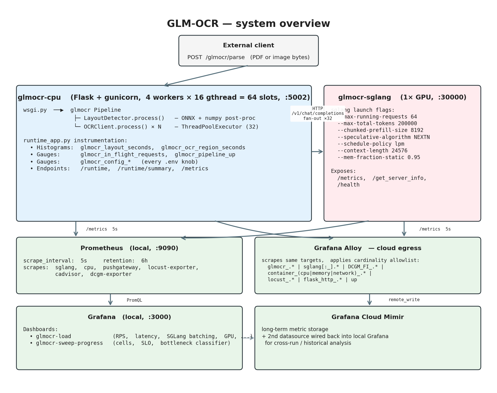
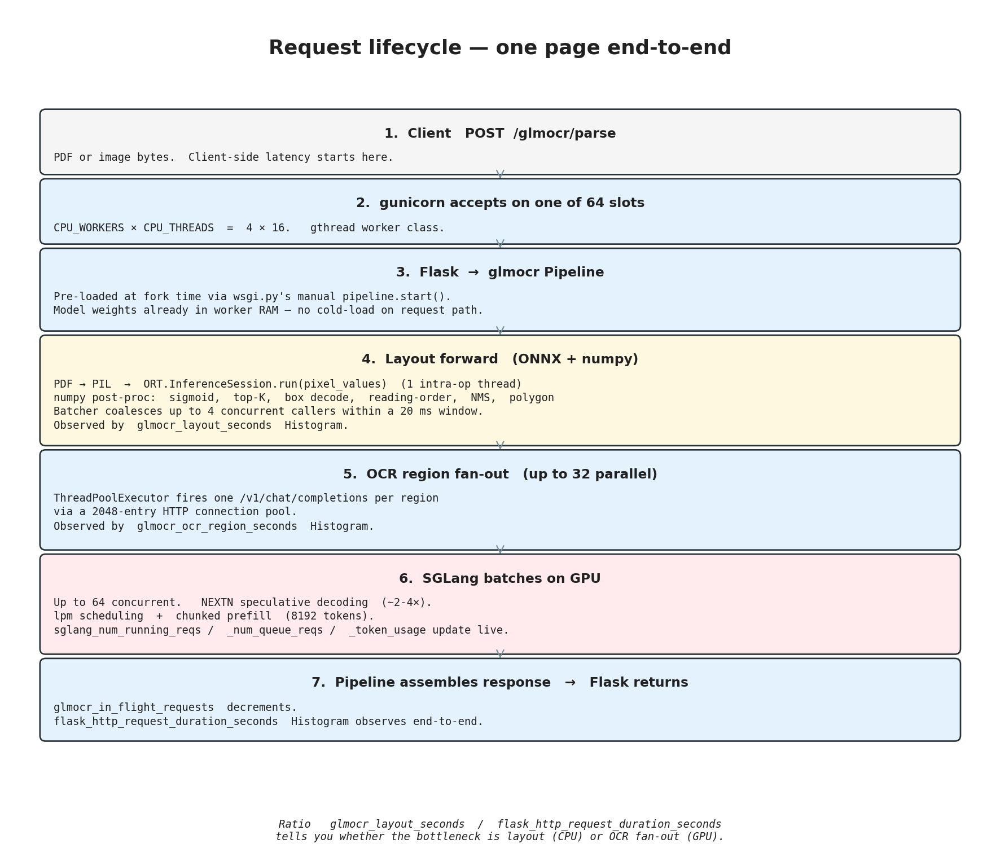
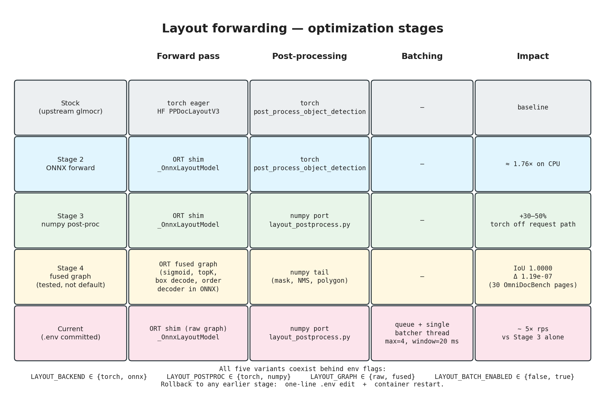
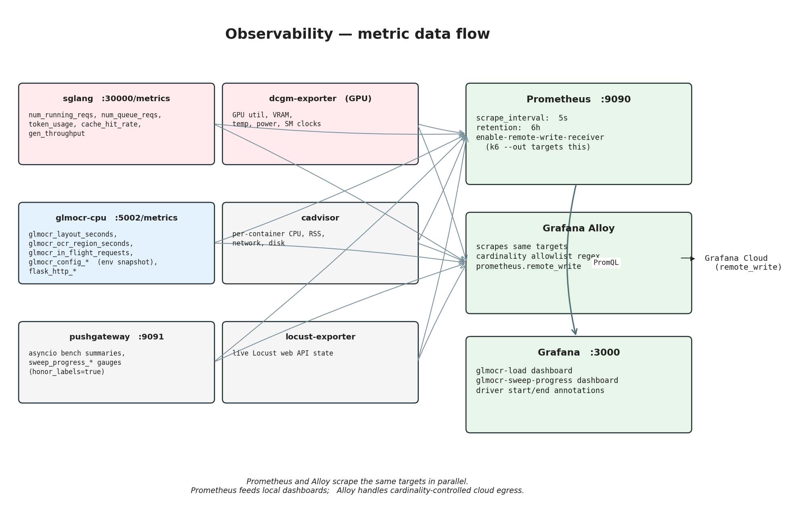

# GLM-OCR Architecture Report

> **Audience:** Manager reviewing whether the current load-test harness can move toward production.
> **Scope:** Current state of the repo as of 2026-04-22 — every knob, trick, and customization from `.env`, two container entrypoints, the 868-line runtime instrumentation module, the numpy post-processing port, and the Grafana Cloud pipeline, all in one place.
> **Secrets:** The real `.env` contains Grafana Cloud credentials (`GRAFANA_CLOUD_PROM_TOKEN`, `GRAFANA_SA_TOKEN`) — those are intentionally redacted in §9 below. Treat this document as shareable; keep the live `.env` unshared.
>
> Diagrams in this document are generated by [`./diagrams/render.py`](./diagrams/render.py). Re-run the script to regenerate PNGs after edits.

---

## 1. Executive summary (30 seconds)

GLM-OCR is a two-container OCR service:

| Container | Role | Tech | Port |
|---|---|---|---|
| `glmocr-cpu` | Public HTTP API, per-page layout detection, per-region fan-out | Flask + gunicorn + glmocr + PP-DocLayoutV3 (ONNX, CPU) | **5002** |
| `glmocr-sglang` | LLM inference server for OCR region crops | SGLang serving `zai-org/GLM-OCR` on one GPU | **30000** |

The two containers talk to each other via plain HTTP (`/v1/chat/completions`). Seven sidecars (Prometheus, Alloy, Pushgateway, Grafana, cAdvisor, DCGM-exporter, Locust-exporter) make the system **the most heavily instrumented** part of the repo — every knob is verifiable, every phase of a request is timed, and every tuning run is archived.

**State of readiness:** functional and well-measured locally. Throughput currently sits at ~1.7 rps on a 2-worker dev box at `c=12` with layout batching on; the `.env` committed to the branch has been tuned to the best-performing combination found in the most recent sweep. Production move is plausible with a CPU=Fargate + GPU=SageMaker split (see §11).

---

## 2. System overview



Top-level topology. The CPU container owns the public HTTP API and all request orchestration (layout detection on CPU, fan-out to SGLang for each OCR region). The GPU container is a pure inference server exposing OpenAI-compatible chat completions. Metrics flow to a local Prometheus for live dashboards and to Grafana Cloud Mimir (via Alloy) for long-term storage.

---

## 3. Request lifecycle — one page end-to-end



Every stage is separately measured. The ratio of `glmocr_layout_seconds / flask_http_request_duration_seconds` tells you whether the bottleneck is layout (CPU) or OCR (GPU-bound fan-out). See §7 for the full metric catalog.

---

## 4. The CPU container — file by file

### 4.1 `Dockerfile.slim`

- Base: `python:3.12-slim-bookworm`.
- System deps: `poppler-utils`, `libgl1`, `libglib2.0-0`, `gettext-base`, `curl`, `g++`.
- **Trick #1: `torch+cpu` pre-install** (lines 36-39). Installs torch from PyTorch's CPU-only index *before* glmocr. Stock torch from PyPI drags in `~5 GB` of `nvidia-cuda-*` / `nvidia-cudnn-*` / `nvidia-nccl-*` wheels that this container never uses (it has no GPU). Saves image size and eliminates cold-start latency on first import.
- **Trick #2: ONNX stack without `optimum`** (lines 43-46). Installs `onnxruntime`, `onnx`, `onnxscript` directly. Skips `optimum` because `optimum 1.x` pins `transformers<5` but glmocr requires `transformers==5.5.4` for the `pp_doclayout_v3` model type — a hard conflict resolved by exporting ONNX via raw `torch.onnx.export`.
- Ships: `wsgi.py`, `runtime_app.py`, `layout_postprocess.py`, `gunicorn_conf.py`, two config templates, `entrypoint.sh`, `export_layout_onnx.py`.

### 4.2 `entrypoint.sh` (`docker/cpu/entrypoint.sh:1-57`)

Three boot steps:

1. **Render `/app/config.yaml` from a template.** Two templates exist — `config.yaml.template` (full layout) and `config.layout-off.template` (layout-bypass: every class maps to "skip"/"abandon"). Chosen by `LAYOUT_ENABLED`. `envsubst` interpolates env vars into the YAML so you can flip behavior without rebuilding.
2. **Export ONNX if needed.** If `LAYOUT_BACKEND=onnx`, run `export_layout_onnx.py` (idempotent — skips if graphs already present in the `./hf-cache` volume).
3. **Wipe `PROMETHEUS_MULTIPROC_DIR`.** `prometheus_client` aggregates metrics from multiple gunicorn workers via files on tmpfs. Stale files from dead workers of a previous boot would otherwise pollute aggregated counters.

Finally `exec gunicorn --config gunicorn_conf.py --workers $CPU_WORKERS --threads $CPU_THREADS --worker-class gthread --timeout $GUNICORN_TIMEOUT wsgi:app`.

### 4.3 `wsgi.py`

Per-worker initialization runs once after each gunicorn `fork()`:

1. Load `/app/config.yaml` via glmocr's `load_config` (falls back across API versions).
2. Call `glmocr.create_app(config)`.
3. **Trick #3: explicitly call `pipeline.start()`**. Upstream `create_app` instantiates the Pipeline but does NOT call `start()`, which means the PP-DocLayoutV3 model weights never actually load. Without this call, every request would pay a ~30s cold-load on the hot path. With it, each worker owns a loaded model in its own memory — no cross-worker locking, no central model server, no shared state.
4. Register `atexit(pipeline.stop)`.
5. Call `runtime_app.install(app)` (attaches `/runtime`, `/runtime/summary`, `/metrics`, the in-flight gauge, and the config gauges).
6. Call `runtime_app.instrument_pipeline(pipeline)` (attaches per-stage histograms + all layout-path swaps, see §5).

### 4.4 `gunicorn_conf.py`

Three lifecycle hooks:

- `post_fork`: enables Python `faulthandler` on `SIGTERM` and `SIGUSR1`. `docker exec glmocr-cpu kill -USR1 <pid>` now dumps every thread's stack into the worker's log. **Critical for debugging stuck workers in prod.**
- `worker_abort`: on gunicorn's hang-timeout kill, dump stacks first so operators know what was stuck.
- `child_exit`: `prometheus_client.multiprocess.mark_process_dead(pid)` — cleans the dead worker's metric files. Without this, counter values for dead workers linger and skew aggregates.

### 4.5 `config.yaml.template` vs `config.layout-off.template`

Both are env-var-driven. The layout-off variant has `label_task_mapping` mapping every class to `skip`/`abandon`, which tells glmocr's layout detector to treat the whole page as a single region. Use-cases:
- Baseline OCR-only measurement (how fast is SGLang alone?).
- Single-region documents where layout detection is overhead.

---

## 5. Layout forwarding — the star of the show

This is where most of the tuning effort has gone. Stock glmocr runs PP-DocLayoutV3 via `transformers` in torch eager mode on CPU, with the post-processing (`post_process_object_detection`) also in torch. That's the slow baseline. What this repo does instead:



### 5.1 The forwarding decision tree (`runtime_app.py:417-801`)

```
LAYOUT_BACKEND ∈ {torch, onnx}
LAYOUT_POSTPROC ∈ {torch, numpy}
LAYOUT_GRAPH ∈ {raw, fused}   (only meaningful when BACKEND=onnx)
LAYOUT_BATCH_ENABLED ∈ {false, true}
LAYOUT_COMPILE ∈ {false, true}
```

That's 2 × 2 × 2 × 2 × 2 = 32 possible combinations, but only a handful matter:

| # | BACKEND | POSTPROC | GRAPH | BATCH | Notes |
|---|---|---|---|---|---|
| Stock | torch | torch | — | off | Upstream glmocr baseline. Slow. |
| Stage 2 | onnx | torch | raw | off | Swap forward pass to ORT. ~1.76× on CPU. |
| Stage 3 | onnx | **numpy** | raw | off | **Torch leaves the request path.** Another ~30-50% gain. |
| Stage 4 (tested, not active) | onnx | numpy | **fused** | off | Sigmoid/topK/box-decode/order-decoder all inside ONNX. Bit-close parity (worst IoU 1.0000, score Δ 1.19e-07 across 30 OmniDocBench pages). |
| **Current production candidate (in .env)** | onnx | numpy | raw | **on** | Stage 3 + cross-request coalescer. ~5× rps uplift over Stage 3 alone. |

### 5.2 What each stage changes (`runtime_app.py`)

**Stage 2 — ONNX forward pass** (`runtime_app.py:597-677`):
- Replaces `ld._model` (the HF `PPDocLayoutV3ForObjectDetection` torch module) with an `_OnnxLayoutModel` shim that runs an `onnxruntime.InferenceSession` and wraps the raw tensors as `torch.from_numpy(...)` into an HF-style `SimpleNamespace`. Upstream post-processing doesn't know it's not talking to torch.
- `ort_opts.intra_op_num_threads = LAYOUT_ONNX_THREADS` (default 1). With `CPU_WORKERS=4` and `LAYOUT_ONNX_THREADS=1`, four concurrent layout calls consume exactly 4 cores — matches the cgroup cleanly. Setting this higher causes thread oversubscription.
- Torch model weights are `del`'d after the shim installs; `gc.collect()` releases the memory.

**Stage 3 — numpy post-proc** (`runtime_app.py:472-595` + `layout_postprocess.py`):
- Replaces `ld.process` entirely with `_numpy_process` (not just `ld._model`). No torch tensors constructed on the request path. Torch still imports at module load (via `transformers`) but is never touched per request.
- `layout_postprocess.py` re-implements in numpy:
  - `_sigmoid` with branchless-stable form,
  - `_np_get_order_seqs` (reading-order pairwise-vote decoder),
  - `np_post_process_object_detection` (sigmoid + top-K + box decode + rescale + mask threshold + score filter + sort-by-order),
  - `np_apply_per_class_threshold` (per-class score gates, e.g., text @ 0.8 vs table @ 0.5),
  - `np_apply_layout_postprocess` (NMS, bbox merge modes, unclip, polygon via cv2).
- Parity: `docker/cpu/tests/parity_in_container.py` asserts per-image score max Δ < 1e-4 and per-box max Δ < 0.01 px vs torch upstream on `smoke_test.png`. `test_layout_postprocess.py` runs on the host (no torch/transformers needed) with synthetic tensors.
- `ld._model` is replaced with a `_NumpySentinel` that raises if invoked — keeps upstream `_validate_runtime_config()` happy (it only checks "not None") while making accidental fall-throughs loud.

**Stage 4 — fused ONNX graph** (`export_layout_onnx.py:107-233`, numpy postproc wiring in `layout_postprocess.py`):
- A second ONNX graph (`pp_doclayout_v3_fused.onnx`) bakes sigmoid, top-K, box decode, target-size rescale, and the reading-order decoder **into the graph itself**. Outputs are already `(scores_topk, labels_topk, boxes_topk_xyxy, order_seq_topk, masks_topk_logits, last_hidden_state)` instead of raw `(logits, pred_boxes, order_logits, out_masks, last_hidden_state)`.
- What stays in numpy: mask sigmoid + threshold, per-image score filter, per-class threshold, NMS, unclip, polygon extraction — all have data-dependent shapes or cv2 dependencies.
- `LAYOUT_GRAPH=fused` flips the runtime to load the fused graph and run only the data-dependent tail in numpy.
- **Status: tested, not active.** `.env` has `LAYOUT_GRAPH=raw` — the safe default. Flipping to `fused` is a one-line change with instant rollback.

**Layout batching (batcher)** (`runtime_app.py:703-788`):
- Concurrent single-image callers drop into a `queue.Queue`; a single background daemon thread pulls up to `LAYOUT_BATCH_MAX=4` within `LAYOUT_BATCH_WINDOW_MS=20` ms and calls `original_layout(images=[...])` once. ORT runs the batched forward pass. Results are fanned back to callers via `concurrent.futures.Future`.
- HF's `PPDocLayoutDetector.process` already does batched forward passes internally; the batcher amortizes the Python preprocessor + postprocessor overhead across callers and exploits batch-wise matmul efficiency.
- **Measured: ~5× rps uplift on the 2-worker setup** (omnidoc-20260421-200758 vs -191156: c=12 went 0.35 → 1.74 rps, c=24 0.31 → 1.69, c=32 0.33 → 1.68).
- Fallthrough: multi-image calls (batch > 1) and visualization calls bypass the coalescer.

**Layout compile** (`runtime_app.py:684-696`):
- Optional `torch.compile(mode="reduce-overhead", dynamic=True)` on the layout model.
- **Measured regression** on the current 4-worker × 8-gthread CPU setup: per-call mean +19%, p95 +18%, 2% fail rate from recompile-triggered timeouts.
- Kept behind an env flag, off by default, so future runs on different hardware can re-evaluate without code changes.

### 5.3 The `/runtime` and `/runtime/summary` endpoints

`runtime_app.py:212-268` exposes two JSON endpoints that let you verify — from outside the container — that every knob took effect:

- `/runtime`: three nested sections.
  - `env_claimed`: raw env vars (what `.env` said).
  - `config_loaded`: what `/app/config.yaml` actually holds (after `envsubst`).
  - `runtime_actual`: live `psutil` view of the gunicorn master, sibling workers, and their threads/RSS/status.
  - `sglang`: live `/get_server_info` + filtered `/metrics` from the GPU container (running requests, queue, token usage, cache hit rate).
- `/runtime/summary`: terse side-by-side — e.g., `sglang_max_running: {env: 64, runtime: 64, live_running: 12, live_queued: 0}`.

**Why this matters for prod:** you never have to guess whether the knob you set actually took effect inside the live process. This is also what the `render_report.py` tooling reads to attach an "integrity" section to every benchmark report.

---

## 6. The GPU container (SGLang)

### 6.1 `docker/gpu/entrypoint.sh`

Builds up an `ARGS=()` array and `exec python3 -m sglang.launch_server "${ARGS[@]}"`. Every flag is guarded by an `[[ -n ... ]]` check so unset env vars simply fall back to SGLang defaults.

### 6.2 Flag-by-flag meaning (all tied to `.env`)

| Flag | `.env` var | Current value | What it does |
|---|---|---|---|
| `--model-path` | `SGL_MODEL_PATH` | `zai-org/GLM-OCR` | HF repo for weights. Downloaded once to `./hf-cache` on first boot. |
| `--served-model-name` | `SGL_SERVED_MODEL_NAME` | `glm-ocr` | The `model:` field clients must send in `/v1/chat/completions`. Must match `OCR_MODEL_NAME` on the CPU side. |
| `--tp-size` | `SGL_TP_SIZE` | `1` | Tensor-parallel shards across GPUs. Raise only with multi-GPU nodes. |
| `--dtype` | `SGL_DTYPE` | `float16` | Model precision. `bfloat16` also valid; `float32` doubles VRAM. |
| `--max-running-requests` | `SGL_MAX_RUNNING_REQUESTS` | `64` | Hard ceiling on concurrent batched requests. Tune against `CPU_WORKERS × CPU_THREADS × OCR_MAX_WORKERS`. |
| `--max-prefill-tokens` | `SGL_MAX_PREFILL_TOKENS` | `8192` | Tokens processed in one prefill step. Caps memory spikes. |
| `--max-total-tokens` | `SGL_MAX_TOTAL_TOKENS` | `200000` | Total KV-cache budget (prompt + gen across all running requests). |
| `--mem-fraction-static` | `SGL_MEM_FRACTION_STATIC` | `0.95` | Fraction of GPU VRAM preallocated for KV cache at startup. |
| `--context-length` | `SGL_CONTEXT_LENGTH` | `24576` | Per-request `prompt + max_tokens` ceiling. **Dropped from model-card default of 131,072** to free per-slot page-table memory. Constraint: glmocr sends `max_tokens=8192`, observed prompts up to ~240 tokens, so needs at least 8432. |
| `--schedule-policy` | `SGL_SCHEDULE_POLICY` | `lpm` | Prefix-cache-aware (`lpm`) vs FIFO (`fcfs`). `lpm` is better when many requests share the OCR system prompt. |
| `--chunked-prefill-size` | `SGL_CHUNKED_PREFILL_SIZE` | `8192` | Splits long prompts into chunks to interleave with decode. Stabilizes tail latency. |
| `--speculative-algorithm` | `SGL_SPEC_ALGORITHM` | `NEXTN` | GLM-OCR ships with MTP/NEXTN draft heads in its weights. Enabled here → ~2-4× decode throughput on OCR outputs. |
| `--speculative-num-steps` | `SGL_SPEC_NUM_STEPS` | `3` | Draft-model rollouts per verification step. |
| `--speculative-eagle-topk` | `SGL_SPEC_EAGLE_TOPK` | `1` | Top-K per draft step. |
| `--speculative-num-draft-tokens` | `SGL_SPEC_NUM_DRAFT_TOKENS` | `4` | Total draft token budget. |
| `--enable-metrics` | always on | — | Exposes `/metrics` Prometheus endpoint. |
| `--trust-remote-code` | always on | — | Required for GLM-OCR's custom HF model code. |

`SGLANG_ENABLE_SPEC_V2=1` env var is set when speculative is on (unlocks the v2 implementation).

### 6.3 Why these values vs. defaults

- **`SGL_MAX_RUNNING_REQUESTS=64`** matches the CPU inbound fan-out (`CPU_WORKERS × CPU_THREADS = 64`). Higher than this queues at SGLang; lower than this queues at the CPU side. Aligning them avoids double-buffering.
- **`SGL_CONTEXT_LENGTH=24576`** is the non-obvious one — it's a ~5× drop from the model card. Pays off in free VRAM that grows `max_total_num_tokens` and batching headroom.
- **`SGL_MEM_FRACTION_STATIC=0.95`** is aggressive; leaves only 5% for runtime scratch. Safe given the static workload (no fine-tuning, no adapter swaps).

---

## 7. Observability stack



### 7.1 Prometheus (`docker/prometheus/prometheus.yml`)

Scrape targets, all at 5s interval:

| Job | Target | Emits |
|---|---|---|
| `sglang` | `sglang:30000/metrics` | Running requests, queue depth, token usage, cache hit rate, gen throughput |
| `glmocr_cpu` | `cpu:5002/metrics` | Flask histograms, pipeline gauges, config gauges, per-stage histograms |
| `pushgateway` | `pushgateway:9091` (`honor_labels=true`) | Asyncio bench result summaries after each run |
| `locust_exporter` | `locust-exporter:9646` | Locust web-API state (current RPS, VUs, failures) |
| `cadvisor` | `cadvisor:8080` | Per-container CPU, memory, network, disk |
| `gpu` | `nvidia-gpu-exporter:9400` | DCGM: GPU util, VRAM, temp, power, SM clocks |
| `prometheus` | `localhost:9090` | Self-monitoring |

Retention is 6h — this is ephemeral by design. Long-term storage is Grafana Cloud Mimir via Alloy.

### 7.2 Alloy (`docker/alloy/config.alloy`)

Lives alongside Prometheus. Does **not** feed local Grafana (Prometheus does that). Its only job is cardinality-controlled egress to Grafana Cloud.

```alloy
rule {
  source_labels = ["__name__"]
  regex = "glmocr_.*|sglang[:_].*|DCGM_FI_.*|container_(cpu|memory|network)_.*|locust_.*|flask_http_.*|up"
  action = "keep"
}
```

This regex is a **cost-control device** — it keeps the active series under the free-tier 10k cap. The `sglang[:_]` alternation handles both the legacy colon-named metrics (`sglang:num_running_reqs`) and the newer underscore form (`sglang_num_running_reqs`) that SGLang builds ship.

### 7.3 Grafana dashboards

**glmocr-load** (main dashboard) — sections:

1. **Drivers — k6**: peak RPS, latency percentiles, error ratio, total requests, VUs active/max, HTTP by method & status.
2. **Drivers — Locust**: live RPS, response-time percentiles, user count, failures.
3. **Drivers — asyncio**: last-run summary (RPS, p50/p95/p99, success/fail) pulled from Pushgateway.
4. **Client / glmocr (CPU)**: Flask request rate by status, 2xx/4xx/5xx stack, latency p50/p95/p99, latency distribution heatmap.
5. **glmocr pipeline internals**: `in_flight_requests`, `pipeline_up` binary.
6. **SGLang (GPU inference)**: running reqs vs cap, queue depth, gen throughput, cache hit rate, token usage %, absolute tokens vs cap.
7. **Containers (cAdvisor)**: CPU %, RSS, network I/O per container.
8. **GPU (DCGM)**: util %, VRAM used vs free, temp, power.
9. **Recent runs**: annotation list (driver start/end markers).
10. **Configuration aggregates**: static gauges showing all the current knob values — `.env` at a glance in Grafana.
11. **Concurrent requests (all layers)**: stacked time-series of CPU in-flight (blue), SGLang running (green), SGLang queued (orange), SGLang cap (red dashed). The single most useful panel for "where are requests living right now?"

**glmocr-sweep-progress** — dashboard for long-running hyperparameter sweeps. Tracks:
- Cells done / total / aborted / clean / SLO-met.
- Progress over time, ETA, cells/hour.
- Per-cell RPS, fail %, p95, p99-vs-SLO (120s line).
- **Bottleneck classifier** (enum: GPU-mem / GPU-compute-full / GPU-compute-under / CPU-container / GPU-queue / CPU-ingress / under-util / slack / no-data).
- Peak utilization breakdown (GPU, VRAM, SGL batch, CPU).

---

## 8. Load-test harness (`loadtest/` + `scripts/`)

### 8.1 Three drivers

| Driver | Use | Output |
|---|---|---|
| `loadtest/asyncio/bench.py` | Sweep harness — deterministic, seeded image pools, fires N concurrent POSTs, pushes summary to Pushgateway | JSON + Pushgateway metrics |
| `loadtest/k6/ocr_load.js` | Realistic VU ramps with thresholds (p95<15s, fail<2%). Uses `--out experimental-prometheus-rw` to remote-write into the same local Prometheus. | Prometheus metrics + k6 summary |
| `loadtest/locust/locustfile.py` | Web-UI-driven exploration. `OCRUser` with `parse_single` and `parse_batch` tasks. Scraped via `locust-exporter`. | Live Grafana panel + CSV |

### 8.2 The asyncio matrix (the tuning workhorse)

`scripts/omnidoc_asyncio_matrix.sh` runs 5 back-to-back trials at c=12, 24, 32, 40, 64 with a shared seeded image pool and 25s idle gaps between trials. The gaps let `augment_matrix_report.py` retroactively segment the Prometheus timeline by ≥20s idle and attach per-trial phase decomposition:

- Flask end-to-end latency.
- Layout forward latency.
- OCR region call latency.
- SGLang end-to-end latency.
- Queue wait, time-to-first-token, inter-token latency (from SGLang's Grafana-native histograms).
- Worker concurrency (in-flight mean/p95/peak).
- SGLang state (running/queued from Prom).

Output: one `.md` file under `loadtest/results/` with a per-c row table + integrity section + phase histograms. Example output: `loadtest/results/omnidoc-20260422-020201-asyncio-matrix.md`.

### 8.3 The staged sweep framework

`scripts/tune_params.py`:

- **Stage A**: 1D scans of each SGLang knob at baseline c=8, N=200 — identifies high-impact axes.
- **Stage B**: 2D grid on the two winning axes (default: `OCR_MAX_WORKERS × SGL_MAX_RUNNING_REQUESTS`).
- **Stage C**: c-curve verification at fixed config.
- **Stage D**: 2×2×2 grid — CPU shape × OCR workers × SGL running cap.

Every stage mutates `.env`, restarts only the affected services (CPU or SGLang), runs `bench.py` with the seeded pool, records per-trial JSON under `loadtest/results/raw/<run-id>/`, aborts trials above 10% fail rate after 40 observations. Progress metrics stream to the sweep-progress dashboard in real time via `sweep_progress_push.py`.

### 8.4 Annotations

Every driver start/end pushes a Grafana annotation (via `loadtest_common.sh::annotate`) so the dashboard has vertical event markers — you can see "load started here" on every panel without flipping time ranges.

---

## 9. Full `.env` knob reference

| Category | Var | Current | Purpose |
|---|---|---|---|
| **CPU** | `CPU_WORKERS` | `4` | Gunicorn processes. |
| | `CPU_THREADS` | `16` | Gthread threads per worker. Total slots = 64. |
| | `GUNICORN_TIMEOUT` | `480` | Hard worker kill after N seconds. Must exceed `OCR_REQUEST_TIMEOUT`. |
| | `GLMOCR_PORT` | `5002` | Listen port. |
| | `OCR_MAX_WORKERS` | `32` | Per-request SGLang fan-out pool. |
| | `OCR_CONNECT_TIMEOUT` / `OCR_REQUEST_TIMEOUT` | `10` / `60` | SGLang HTTP timeouts. |
| | `OCR_RETRY_MAX` / `OCR_RETRY_BACKOFF_BASE` / `_MAX` | `1` / `0.5` / `8` | Retry policy for 429/5xx. |
| | `OCR_CONN_POOL` | `2048` | HTTP pool. Must be ≥ `CPU_THREADS × OCR_MAX_WORKERS = 512` or you get pool-exhaustion 503s masquerading as SGLang failures. Set generously. |
| | `OMP_NUM_THREADS` / `MKL_NUM_THREADS` | `1` / `1` | Torch/MKL math thread caps. Multi-worker × high OMP = cgroup contention; throttle to 1 so `CPU_WORKERS × 1 = 4` matches the 8-vCPU cgroup when only half the workers are in layout. |
| **Layout** | `LAYOUT_ENABLED` | `true` | `false` = skip layout detection, send whole page. |
| | `LAYOUT_DEVICE` | `cpu` | CUDA was evaluated and rejected on 8 GB card — stole VRAM from SGLang's KV cache. |
| | `LAYOUT_USE_POLYGON` | `false` | Extract polygon points per region (cv2 contour). |
| | `LAYOUT_BACKEND` | `onnx` | `torch` or `onnx`. ONNX ≈ 1.76× over torch eager on CPU. |
| | `LAYOUT_ONNX_THREADS` | `1` | ORT intra-op threads. 1 per worker aligns with cgroup. |
| | `LAYOUT_POSTPROC` | `numpy` | `torch` (fallback) or `numpy` (removes torch from request path). |
| | `LAYOUT_GRAPH` | `raw` | `raw` (default) or `fused` (tested, not yet active — sigmoid/topK/box-decode/order-decoder in graph). Parity: 30/30 OmniDocBench, worst IoU 1.0000, score Δ 1.19e-07. |
| | `LAYOUT_COMPILE` | `false` | `torch.compile` — measured regression on current setup. Off. |
| | `LAYOUT_BATCH_ENABLED` | `true` | Cross-request layout coalescer. ~5× rps on 2-worker. |
| | `LAYOUT_BATCH_MAX` | `4` | Max requests per coalesced call. |
| | `LAYOUT_BATCH_WINDOW_MS` | `20` | Coalescing wait budget in ms. |
| **Routing** | `SGLANG_HOST` / `SGLANG_PORT` / `SGLANG_SCHEME` | `sglang` / `30000` / `http` | Where the CPU container finds SGLang (compose DNS / ECS Cloud Map). |
| | `OCR_MODEL_NAME` | `glm-ocr` | Must match `SGL_SERVED_MODEL_NAME`. |
| **SGLang** | `SGL_IMAGE_TAG` | `latest` | Pin to a version (e.g. `v0.5.10.post1`) for reproducibility in prod. |
| | `SGL_MODEL_PATH` | `zai-org/GLM-OCR` | HF repo. |
| | `SGL_SERVED_MODEL_NAME` | `glm-ocr` | `/v1/chat/completions` model label. |
| | `SGL_TP_SIZE` | `1` | Tensor-parallel shards. |
| | `SGL_DTYPE` | `float16` | Model precision. |
| | `SGL_MAX_RUNNING_REQUESTS` | `64` | Concurrent-request cap. |
| | `SGL_MAX_PREFILL_TOKENS` | `8192` | Prefill step budget. |
| | `SGL_MAX_TOTAL_TOKENS` | `200000` | Total KV-cache budget. |
| | `SGL_MEM_FRACTION_STATIC` | `0.95` | VRAM preallocated for KV cache. |
| | `SGL_CONTEXT_LENGTH` | `24576` | Per-request seq ceiling. Dropped from 131,072 to free VRAM. |
| | `SGL_CHUNKED_PREFILL` | `true` | Enable chunked prefill. |
| | `SGL_CHUNKED_PREFILL_SIZE` | `8192` | Chunk size in tokens. |
| | `SGL_SCHEDULE_POLICY` | `lpm` | Prefix-cache-aware scheduling. |
| | `SGL_SPECULATIVE` | `true` | Enable NEXTN speculative decoding. |
| | `SGL_SPEC_ALGORITHM` | `NEXTN` | Uses GLM-OCR's baked-in MTP heads. |
| | `SGL_SPEC_NUM_STEPS` | `3` | Rollouts per verification. |
| | `SGL_SPEC_EAGLE_TOPK` | `1` | Top-K per draft step. |
| | `SGL_SPEC_NUM_DRAFT_TOKENS` | `4` | Total draft tokens. |
| **Observability** | `GRAFANA_CLOUD_PROM_URL` / `_URL_READ` / `_USER` / `_TOKEN` | *(redacted)* | Mimir remote_write + read endpoints and credentials. |
| | `GRAFANA_URL` / `GRAFANA_SA_TOKEN` | *(redacted)* | MCP service-account for dashboard automation. |

---

## 10. The "tricks" — non-obvious customizations vs. stock glmocr

Compressed to the ones that would surprise a reviewer coming fresh:

1. **Two config templates**, chosen at boot by `LAYOUT_ENABLED`. Flips layout detection without a rebuild.
2. **Manual `pipeline.start()`** in `wsgi.py` — upstream `create_app` forgets this, so the layout model would otherwise cold-load on the first request of every worker.
3. **`torch+cpu` pre-install** saves ~5 GB of NVIDIA wheels in the CPU image.
4. **Runtime model hot-swap** — `ld._model` replaced at `instrument_pipeline` time with either an ORT shim (`_OnnxLayoutModel`) or a `_NumpySentinel` that raises on invocation. Upstream internal sanity checks still pass because both objects have the right shape.
5. **Fused ONNX graph** baking sigmoid/topK/gather/box-decode/rescale/order-decoder into the inference boundary — built but not yet default.
6. **Cross-request layout coalescer** — a queue + single-thread batcher that turns N concurrent single-image calls into one ORT call. The mechanical equivalent of what SGLang's scheduler already does GPU-side.
7. **Prometheus multiproc directory wipe on boot** — prevents dead-worker counters from accumulating across container lifecycles.
8. **Faulthandler on SIGTERM + SIGUSR1** — on-demand stack dumps without gdb, surfaced via container logs.
9. **Dropped `SGL_CONTEXT_LENGTH` from 131072 → 24576** — model-card default was 5× what an OCR region needs; drop buys VRAM for larger batches.
10. **Cardinality allowlist in Alloy** — explicit `__name__` keep-list instead of sending everything to Grafana Cloud. Prevents silent bill blow-up when new metrics are added.
11. **Per-trial Prometheus segmentation via idle gaps** — run-time-free retroactive phase decomposition. No in-band tagging needed.
12. **Bottleneck classifier enum on the sweep dashboard** — automatic label for "what was the limit on this cell" (GPU mem / GPU compute / CPU ingress / under-util / etc.).
13. **Per-stage Flask histogram bucket override** (`runtime_app.py:277-280`) — default `prometheus_flask_exporter` tops out at 10s; cold starts exceed 60s, so all quantiles pinned to 10. Custom buckets go out to 180s.

---

## 11. Production-readiness assessment

### What's solid
- **Observability**: dashboards, integrity endpoints, per-stage histograms, cardinality control, parity tests. Ahead of most services at this stage.
- **Deterministic benchmarking**: seeded pools, staged sweeps, abort-on-fail gates, per-trial phase decomposition. The team can answer "what changed?" with numbers.
- **Config surface**: every knob is an env var, every env var becomes a Prometheus gauge, every Prometheus gauge is on a dashboard. No hidden state.
- **Rollback paths**: every optimization stage (`LAYOUT_BACKEND`, `LAYOUT_POSTPROC`, `LAYOUT_GRAPH`, `LAYOUT_BATCH_ENABLED`, `LAYOUT_COMPILE`) is an env-flag with instant revert to the previous stage.

### What needs work before prod
- **Secrets live in `.env`** with a Grafana token and a service-account token. For prod move to a secret store (AWS Secrets Manager / SSM Parameter Store / Kubernetes Secret). Redact before sharing.
- **SGL image pinned to `latest`**. For prod pin to a version tag (`v0.5.10.post1` or similar) so deploys are reproducible.
- **HF cache lives in a bind mount** (`./hf-cache`). Won't survive a fresh prod instance without S3-backed model-artifact plumbing or image-baked weights.
- **Retry policy is aggressive** (`OCR_RETRY_MAX=1`). Under SGLang queue saturation this currently surfaces as 5xx instead of long tail. Acceptable for load-test; production should decide on retry-vs-latency trade.
- **No rate limiting on the public `/glmocr/parse`**. Admission is gated only by `CPU_WORKERS × CPU_THREADS=64`. Fine behind an internal client; add an ALB-level or middleware rate limiter before public exposure.
- **Prometheus retention is 6h**. Grafana Cloud Mimir is the long-term store — verify that remote_write queue depth stays healthy under sustained load (already on the Alloy `/debug` UI at port 12345).
- **Grafana Cloud free-tier cap (10k active series)**. Cardinality allowlist protects this today; any new `_bucket` metric could blow it. Add an Alloy warning when series count > 8k.
- **No chaos / failure tests**. System has never been tested with SGLang down, network partitioned, or OOM. Should add at least a "SGLang 503" happy path → error path test before shipping.

### Recommended prod shape
- **CPU container → AWS Fargate**: keeps the full observability stack (Prom scraping the task works fine via ECS service discovery), env-var iteration reasonably fast (task def update ~60s), no GPU needed.
- **GPU container → AWS SageMaker endpoint** (or EC2 behind an NLB if SM's managed-tax isn't worth the lifecycle features). SM costs ~40% premium on the GPU hours but buys autoscaling, blue/green, and model registry.
- Cross-service call: `boto3.sagemaker-runtime.invoke_endpoint` from the Fargate side. SigV4 adds ~0.5-1 ms signing + VPC endpoint hop ~1-3 ms. With `OCR_MAX_WORKERS=32` fan-out and ~20 regions per page, ~40-80 ms per-page overhead. Measure before and after.
- Weights: upload `zai-org/GLM-OCR` to S3 as SageMaker `ModelDataUrl` so instance cold-starts don't re-download from HF.
- SGLang `/metrics` inside SM: run a small Alloy sidecar in the SM container that scrapes `localhost:30000/metrics` and remote_writes to Grafana Cloud Mimir directly.

---

## 12. Critical file index (for follow-up exploration)

| Area | File | Lines of interest |
|---|---|---|
| Topology | `docker-compose.yml` | 3-146 (services), 148-293 (observability) |
| CPU image | `docker/cpu/Dockerfile.slim` | 36-56 (torch+cpu trick, ONNX stack) |
| CPU boot | `docker/cpu/entrypoint.sh` | 13-42 |
| Worker init | `docker/cpu/wsgi.py` | 47-56 (pipeline.start + instrument) |
| Gunicorn hooks | `docker/cpu/gunicorn_conf.py` | 27-75 |
| Runtime observability | `docker/cpu/runtime_app.py` | 212-268 (/runtime), 283-311 (prom), 417-801 (layout paths) |
| Layout forwarding — ORT shim | `docker/cpu/runtime_app.py` | 597-677 |
| Layout forwarding — numpy path | `docker/cpu/runtime_app.py` | 472-595 |
| Layout forwarding — batcher | `docker/cpu/runtime_app.py` | 703-788 |
| Numpy post-proc | `docker/cpu/layout_postprocess.py` | 41-82, 198-286, 462-627, 734-764 |
| ONNX export | `docker/cpu/export_layout_onnx.py` | 48-104 (raw), 107-233 (fused) |
| SGLang boot | `docker/gpu/entrypoint.sh` | 9-60 |
| Prom scrape | `docker/prometheus/prometheus.yml` | full file |
| Cloud egress | `docker/alloy/config.alloy` | 14-58 (scrape), 65-92 (allowlist + remote_write) |
| Main dashboard | `docker/grafana/dashboards/glmocr-load.json` | full |
| Sweep dashboard | `docker/grafana/dashboards/glmocr-sweep-progress.json` | full |
| Matrix harness | `scripts/omnidoc_asyncio_matrix.sh` | 1-111 |
| Sweep driver | `scripts/tune_params.py` | 1-150 |
| Report renderer | `scripts/lib/render_report.py` | sweep mode |
| Retro phase split | `scripts/augment_matrix_report.py` | full (~31 KB) |
| Live env reference | `.env` | full (149 lines) |

---

## 13. Verification (how to validate this doc against the live system)

The doc describes behavior, not code changes, so "verification" is really "confirm every claim against the running system":

1. **Every `.env` value → live gauge.** `curl http://localhost:5002/metrics | grep glmocr_config_` should return one line per row in the `.env` table in §9. Cross-check numbers match.
2. **Layout forwarding path.** Boot the CPU container and grep logs for `[layout] numpy postproc enabled` or `[layout] onnxruntime backend enabled` or `[layout] torch` — one of these three lines identifies which path is live. Should match the `LAYOUT_BACKEND`/`LAYOUT_POSTPROC` setting in `.env`.
3. **Parity.** `docker exec glmocr-cpu python -m pytest /app/tests/parity_in_container.py -v` — asserts bit-close parity between the numpy port and torch upstream on the smoke image.
4. **Fused-graph parity.** The committed validation report (mentioned in `.env:66`) showed worst IoU 1.0000 and score Δ 1.19e-07 across 30 OmniDocBench pages. Re-run the parity script if the fused path is ever flipped to the default.
5. **End-to-end smoke.** `curl -F "file=@scripts/smoke_test.png" http://localhost:5002/glmocr/parse` — should return JSON with detected regions + OCR text in under 10s on a warm container.
6. **Integrity snapshot.** `curl http://localhost:5002/runtime/summary | jq` should show every env/runtime pair matching (and `live_running` + `live_queued` reflecting actual load).
7. **Dashboard alive.** Open `http://localhost:3000` — GLM-OCR Load Test dashboard should show non-zero data on all panels during a `scripts/omnidoc_asyncio.sh` run.
8. **Grafana Cloud egress.** Alloy UI at `http://localhost:12345` → "Graph" tab → check that `prometheus.remote_write.grafanacloud` has non-zero `sent_samples_total` and zero `dropped_samples_total`.
9. **Report full regression.** `bash scripts/omnidoc_asyncio_matrix.sh` with a fresh run_id — produces a new `.md` in `loadtest/results/`; compare the per-c latency table to the most recent committed run to spot any regressions.
10. **Regenerate diagrams.** `python docs/diagrams/render.py` — produces the four PNGs referenced from this document. Run after any edit to `render.py`.

No code changes are being proposed by this document. Production moves would be planned separately once the manager has signed off on architecture.
