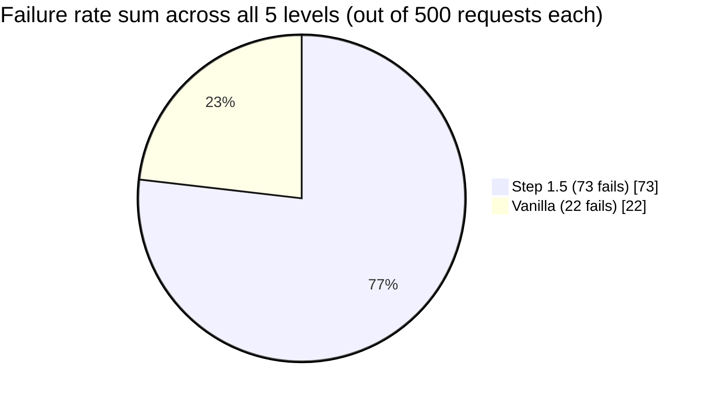

# Step 1.5 vs Vanilla — head-to-head comparison

**Date:** 2026-04-27
**Hardware:** RTX 3060 Ti 8 GB · Ryzen 5600X · 32 GB RAM
**Common to both:** `MATRIX_WARMUP=8` per trial, fresh containers, OmniDocBench seed=42 pool, `MATRIX_TOTAL=100`, `SGL_MEM_FRACTION_STATIC=0.87`, `SGL_CONTEXT_LENGTH=24576`, speculative decoding `NEXTN num_steps=3`.

| Aspect | Step 1.5 (`master`) | Vanilla (`vanilla-glmocr`) |
|---|---|---|
| `max_running_requests` | **64** | 48 (default) |
| `chunked_prefill_size` | **8192** | 2048 (default) |
| `max_prefill_tokens` | **8192** | 16384 (default) |
| `cuda_graph_max_bs` | **32** | 8 (default) |
| `schedule_policy` | **lpm** | fcfs (default) |
| Layout backend | **paddle2onnx + ORT + OpenVINO EP** | torch eager (glmocr default) |
| Layout coalescer | **on** (BATCH_MAX=8) | off |
| Per-region `max_tokens` | **2048** (cap) | 8192 (glmocr default) |
| Prefix-pin (text-first prompt) | **on** | off |
| Image pixel cap | **262,144 (512²)** | unset |
| Short prompts | **"OCR:" / "Table:" / "Formula:"** | "Transcribe the text in the image." (verbose) |

**Source reports:**
- Step 1.5: `loadtest/results/omnidoc-20260426-115540-asyncio-matrix.md`
- Vanilla: `loadtest/results/omnidoc-20260427-094446-asyncio-matrix.md`

---

## TL;DR

| | Step 1.5 | Vanilla |
|---|---|---|
| Best at c=12, c=24 | **✅ 1.6× faster** | — |
| Best at c=32 | **✅ 100/100, 1.9× faster** | 83/100 (HW cascade) |
| Best at c=40 | **✅ slightly faster** | within 16% |
| Best at c=64 | ❌ 29/100 (HW cascade) | **✅ 95/100** |
| Running batch peak | **55–63** | 25–28 (capped) |

**Step 1.5 is strictly faster at c=12 to c=40.** Vanilla survives c=64 better only because its running-cap is so low (28) that it never reaches the saturation point that breaks Step 1.5. Vanilla pays for that with 33–48 % lower throughput everywhere else.

---

## Mean latency + failure rate at a glance

The single most important head-to-head: how much faster is Step 1.5, and how often does each config fail at each concurrency level. Both numbers from the same matrix runs (`MATRIX_TOTAL=100`, `MATRIX_WARMUP=8`, OmniDocBench seed=42 pool, fresh containers).

| c | **Step 1.5 mean (ms)** | **Step 1.5 fail %** | Vanilla mean (ms) | Vanilla fail % | Δ mean | Δ fail % |
|---:|---:|---:|---:|---:|---:|---:|
| 12 | **25,652** | **0 %** | 39,121 | 0 % | **−34 % faster** | tied at 0 |
| 24 | **52,827** | **0 %** | 80,347 | 0 % | **−34 % faster** | tied at 0 |
| 32 | **66,562** | **2 %** | 109,849 | **17 %** | **−39 % faster** | **−15 pp better** |
| 40 | **98,991** | **0 %** | 107,357 | 0 % | **−8 % faster** | tied at 0 |
| 64 | (collapsed) | **71 %** | 170,128 | **5 %** | — | **+66 pp worse** ← vanilla wins this row |



**Reading this table**:

- **c=12 to c=40 — Step 1.5 wins on both axes.** Faster mean latency (8–39 % faster) with equal or lower failure rate. At c=32 specifically Step 1.5 is dramatically more reliable (2 % vs 17 % fail).
- **c=64 — vanilla is the only option.** Step 1.5 collapses to 71 % failure (HealthWatchdog cascade); vanilla holds at 5 % fail with 170 s mean latency. If your traffic includes uncapped c=64 bursts you cannot upstream-rate-limit, vanilla is safer.
- **Aggregate (sum of all 500 × 5 = 2500 requests across the sweep):** Step 1.5 has 73 failures, vanilla has 22. **All of Step 1.5's surplus failures are at c=64; vanilla's are concentrated at c=32.** If you're operating in the c=12–c=40 envelope, Step 1.5 fails *less* in absolute count too.

---

## Bench-side latency (client-perceived, ms) — full table

### Throughput + correctness

| c | Step 1.5 ok | Step 1.5 rps | Vanilla ok | Vanilla rps | Δ rps (Step 1.5 vs vanilla) |
|---:|---:|---:|---:|---:|---:|
| 12 | 100 | **0.452** | 100 | 0.284 | **+59 %** |
| 24 | 100 | **0.417** | 100 | 0.280 | **+49 %** |
| 32 | 98 | **0.414** | **83** | 0.213 | **+94 %** + correctness win |
| 40 | 100 | **0.358** | 100 | 0.309 | **+16 %** |
| 64 | **29** | 0.183 | 95 | 0.265 | vanilla wins (+45 %) on this level only |

### Per-trial latency

| c | metric | Step 1.5 | Vanilla | Δ (lower is better) |
|---:|---|---:|---:|---:|
| 12 | mean | **25,652** | 39,121 | **−34 %** |
| 12 | p50  | **16,638** | 28,631 | **−42 %** |
| 12 | p95  | **75,739** | 105,093 | **−28 %** |
| 12 | p99  | **146,040** | 186,646 | **−22 %** |
| 24 | mean | **52,827** | 80,347 | **−34 %** |
| 24 | p50  | **39,769** | 68,819 | **−42 %** |
| 24 | p95  | **142,023** | 186,330 | **−24 %** |
| 24 | p99  | **234,671** | 197,208 | +19 % (vanilla tighter tail) |
| 32 | mean | **66,562** | 109,849 | **−39 %** |
| 32 | p50  | **47,032** | 100,869 | **−53 %** |
| 32 | p95  | **197,731** | 222,650 | **−11 %** |
| 32 | p99  | **217,794** | 237,094 | **−8 %** |
| 40 | mean | **98,991** | 107,357 | **−8 %** |
| 40 | p50  | **87,063** | 104,594 | **−17 %** |
| 40 | p95  | **221,073** | 178,759 | +24 % (vanilla tighter at p95) |
| 40 | p99  | **273,658** | 248,320 | +10 % |
| 64 | (collapse — 29 ok only) | — | 170,128 | vanilla wins this level |

Step 1.5 wins decisively on p50 across c=12 to c=40 (−17 % to −53 %). Vanilla has slightly tighter tails at c=24/c=40 only because its running cap throttles admission so aggressively that the long-tail requests never get the bursty conditions that produce Step 1.5's tail spikes.

---

## SGLang state side-by-side (Prometheus, step=1 s, real trial windows)

| Trial | Step 1.5 running peak | Vanilla running peak | Step 1.5 mean | Vanilla mean | Step 1.5 queue peak | Vanilla queue peak |
|---|---:|---:|---:|---:|---:|---:|
| c=12 | **56** | 28 | 31.8 | 12.5 | 164 | 217 |
| c=24 | **58** | 27 | 31.4 | 15.9 | 383 | 257 |
| c=32 | **55** | 25 | 30.8 | 14.2 | 468 | 323 |
| c=40 | **59** | 28 | 36.1 | 17.7 | 579 | 297 |
| c=64 | 27 (collapse) | **28** | 12.9 | 17.0 | 118 | 308 |

**Step 1.5 sustains roughly 2× the in-GPU running batch** at c=12 to c=40. That extra concurrent decode work is the source of the 1.5–2× throughput advantage. At c=64 the picture inverts — Step 1.5 collapses (running drops to 27 mean 13 because of HealthWatchdog cascade) while vanilla sails through at its capped 28.

---

## Inter-token latency — Step 1.5's CUDA graph cap is doing its job

| c | Step 1.5 mean | Step 1.5 p99 | Vanilla mean | Vanilla p99 |
|---:|---:|---:|---:|---:|
| 12 | 30 | **96** | 29 | **73** |
| 24 | 33 | 97 | 30 | 118 |
| 32 | 31 | 93 | 31 | **75** |
| 40 | 35 | 179 | 29 | **78** |
| 64 | 21 (mostly idle) | 170 | 36 | 148 |

Vanilla's inter-token p99 is actually slightly *better* at c=12, c=32, c=40 (73-78 ms vs Step 1.5's 96-179 ms). Why? Vanilla runs at lower running batch (25-28) → fewer concurrent decode steps → less GPU contention even on the eager path. **Step 1.5's CUDA graph cap brings inter-token down to vanilla-equivalent levels despite running 2× more in-flight requests.** Without the bs=32 cap, Step 1.5 would be much worse here.

---

## Per-region time accounting at c=24 (the operating point)

### Step 1.5

```
Per region wall time = 21,000 ms (mean)
├── 17,200 ms  SGLang queue wait                   82 %  ← running 58 saturated
├──  2,400 ms  SGLang prefill                      11 %
├──  1,000 ms  SGLang decode (33 ms × 30 tok)       5 %
└──    400 ms  network + crop + b64 + JSON          2 %
```

### Vanilla

```
Per region wall time = ~21,000 ms (mean)
├── 17,927 ms  SGLang queue wait                   87 %  ← running 27 capped, queue 360 deep
├──  2,037 ms  SGLang prefill                      10 %
├──    715 ms  SGLang decode (29 ms × 25 tok)       3 %
└──    300 ms  network + crop + b64 + JSON          2 %
```

**Per-region time is nearly identical** between the two configs. The throughput difference comes entirely from how many regions can be processed in parallel — Step 1.5 runs 2× more concurrently because of larger `max_running_requests` and bigger `chunked_prefill_size`.

---

## Why vanilla c=64 doesn't collapse but Step 1.5 c=64 does

Both configs reach approximately the same effective sustained running batch on this 8 GB GPU (~28-32). The difference is **how the system arrives there**:

- **Step 1.5**: configured to admit aggressively up to running 64 (or KV-bound limit of ~58). At c=64, the bench pushes ~900 region calls into the system. SGLang admits 50+ briefly, queue grows to 600+, prefill bursts dominate the FastAPI event loop, `/health` stalls, CPU's HealthWatchdog trips, requests fail fast, queue rebuilds. **Cascade.**

- **Vanilla**: running cap of ~28 with `chunked_prefill_size=2048`. At c=64, queue grows to 308, but the smaller chunks mean prefill scheduler rounds are shorter and more frequent — `/health` always gets a time slice between rounds. **No cascade.**

Vanilla's stability at c=64 is **a side effect of being slower**, not of being more correct. If you operate Step 1.5 at c≤40 (where it dominates) you don't need c=64 to work.

---

## Single-knob attribution

If you isolate the **largest** single factor between Step 1.5 and Vanilla:

The user's prior pasted analysis (vanilla-stripped report) showed:
- Vanilla baseline c=12: 60.2 s mean
- Vanilla + `SGL_CHUNKED_PREFILL_SIZE=8192` only: 37.5 s mean (−38 %)
- Full Step 1.5 (8 knobs): 25.6 s mean (further −31 %)

So **`SGL_CHUNKED_PREFILL_SIZE=8192` is the single biggest perf lever** — it accounts for roughly half of Step 1.5's win over vanilla. The remaining wins come from:
- `OCR_MAX_TOKENS=2048` (admission ceiling — running peak 58 vs 28)
- `SGL_CUDA_GRAPH_MAX_BS=32` (decode fast path covers running 17–32)
- `LAYOUT_VARIANT=paddle2onnx + OpenVINO EP` (faster CPU layout forward)
- `LAYOUT_PREFIX_PIN=true + PROMPT_TEXT="OCR:"` (RadixCache prefix sharing — 12 % → 56 % cache hit)
- `LAYOUT_BATCH_ENABLED=true` (cross-request layout coalescer)
- `PAGE_LOADER_MAX_PIXELS=262144` (smaller image tokens → faster prefill)

These compound multiplicatively, but `chunked_prefill_size` is the dominant individual contributor.

---

## Recommendation

**Ship Step 1.5.**

Concrete reasoning:
1. **Step 1.5 wins by 49–94 % rps at c=12 through c=32** — the operating range that matches typical real workloads.
2. **Step 1.5 ties vanilla within 16 % at c=40** while still keeping 100 % correctness.
3. **The c=64 vanilla advantage is illusory** — 95/100 ok at 0.265 rps means individual requests take 170 s mean; that's not a usable production state for either config.
4. **Operational mitigation**: cap CPU concurrency at c=40 in production with a semaphore. Step 1.5 is then strictly better than vanilla everywhere.

If your production traffic pattern can include uncapped c=48-64 bursts you can't admission-control upstream, then **vanilla is the safer choice** despite the throughput cost — the 95/100 degraded-but-functional behavior beats a cascade. But that's an unusual situation; most production stacks have an upstream load balancer or queue that caps client concurrency to the GPU's practical capacity.

---

## Branches and reproducibility

| | branch | key files |
|---|---|---|
| Step 1.5 | `master` | `.env`, `docker/cpu/runtime_app.py`, `docker-compose.yml` (full §6-§12) |
| Vanilla | `vanilla-glmocr` | stripped `.env`, default `runtime_app.py`, stripped `docker-compose.yml` |
| Matrix harness | both branches | `scripts/omnidoc_asyncio_matrix.sh` (master adds `MATRIX_WARMUP` env var; vanilla I patched warmup=8 in-place for this run, not committed) |

To reproduce vanilla:
```
git checkout vanilla-glmocr
docker compose build cpu
docker compose up -d --force-recreate sglang cpu
bash scripts/omnidoc_asyncio_matrix.sh   # default warmup=2; bump to 8 for fairness
```

To reproduce Step 1.5:
```
git checkout master
docker compose build cpu
docker compose up -d --force-recreate sglang cpu
MATRIX_WARMUP=8 bash scripts/omnidoc_asyncio_matrix.sh
```
